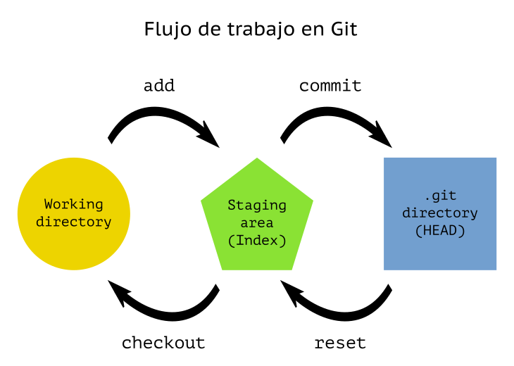

[<- Inicio](../../../)

[Tabla de Contenido](SUMMARY.md)

# Flujo de trabajo de Git

El sistema de control de versiones centralizado y distribuido de __Git__, opera bajo tres estados según se muestra a continuación:

__Working Directory__: Es el directorio de trabajo con los archivos los cuáles te encontrás trabajando. En este momento Git no tiene control de ellos, y el estado de Git lo detecta como `untracked files` en el caso que sean archivos nuevos, y si se modificaron archicos controlados previamente por git se los denomina `unstaged files`.

__Staging Area__: 

__Git repository__: 

Si una versión concreta de un archivo está en el directorio de Git, se lo considera confirmada como _committed_. Si ha sufrido cambios desde que se obtuvo del repositorio, pero ha sido añadida al área de preparación, está siendo preparada como _staged_. Y si ha sufrido cambios desde que se obtuvo del repositorio, pero no se ha preparado, está modificada como _modified_.