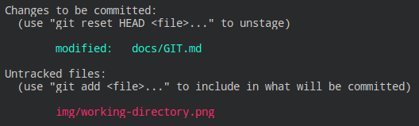

[<- Inicio](../README.md)

[Tabla de Contenidos](SUMMARY.md)
# El Flujo de Trabajo en Git
Git es un sistema de control de versiones centralizado y distribuido, el cual administra las versiones por medio de `snapshots` (_instantáneas_) codificadas en [`SHA-1`](https://es.wikipedia.org/wiki/Secure_Hash_Algorithm#SHA-1). Git administra las versiones de un directorio con la colección de todas las sub-carpetas y archivos que esta contiene, estableciendo así el concepto de un repositorio. Para establecer el control con Git en un directorio, se ejecuta por única vez un comando que indica la inicialización del mismo:
```git
git init
```
También existe la posibilidad de que el comando de inicialización de Git realice la creación del directorio que utilizará como repositorio en un único paso, como se muestra en el ejemplo a continuación:
```git
git init nombre-del-repositorio
```
> Si bien se puede nombrar un directorio con espacios encerrándolo por medio del uso de las dobles comillas, no es una práctica recomendable definirlo de esta manera.

La inicialización del repositorio crea un directorio oculto `.git/` en su raíz, donde Git gestionará y almacenará todas sus instántaneas. A partir de este momento, Git comienza a operar con el control de versiones por medio de tres estados, según se muestra en la imagen a continuación:


> __Imagen 1__: _Los 3 estados de Git._

Luego de contar con el repositorio inicializado, el comando para ver el estado actual de control es por medio del comando:
```git
git status
```
A continuación pasamos a comprender el funcionamiento de los estados de Git de manera detallada.
### Working Directory
Este es el estado donde se encuentran los archivos con los cuáles nos encontramos trabajando en el repositorio. En este momento Git no tiene control de almacenamiento de lo archivos, ya que se encuentran en plena edición/creación por parte del usuario. Si se ejecuta el comando `git status` luego de modificar/crear archivos, Git muestra por ejemplo el siguiente mensaje:


> __Imagen 2__: _Estado Working Directory de Git._

En la sección `Changes not staged for commit` podemos ver que Git informa que tiene archivos modificados posteriormente a su última versión controlada, y marca los archivos como `modified`. Más abajo en `Untracked files` se muestran aquellos archivos nuevos en el repositorio que no tienen control de versión aún.

Git nos informa del uso de dos comandos, donde uno de ellos sirve para descartar los cambios realizados desde el último `commit`, según se muestra en el siguiente comando de ejemplo:
```git
git checkout docs/GIT.md
```
En este ejemplo estamos descartando los cambios realizados sobre el archivo ubicado en `docs/GIT.md`. El otro comando lo usaremos para pasar al próximo estado de Git, el cual se explica a continuación.
### Staging Area 
Para indicarle a Git que nos almacene el estado de los archivos creados/modificados por medio de una instantánea, lo haremos con el comando que podemos observar en la __Imagen 2__, por ejemplo:
```git
git add docs/GIT.md
```
Siguiendo el caso, Git alojó el archivo ubicado en `docs/GIT.md` al área de preparación de trabajo (_staged_), mientras que el archivo `img/working-directory.png` sigue en el estado anterior del directorio de trabajo:


> __Imagen 3:__ _Estado Staging Area de Git._

Ahora bien, también podemos pasar el archivo `img/working-directory.png` al área de preparación con el comando:
```git
git add img/working-directory.png
```
O en el caso de que quisiéramos agregar múltiples archivos a este estado, lo podemos lograr ejecutando el comando:
```git
git add -A
```
Al agregar los archivos al área de preparación, Git nos indica que estos archivos están listos para ser confirmados (`Changes to be committed`), ya que Git nos da el espacio para que podamos ir trabajando con los archivos entre los dos primeros estados, hasta que en un momento definamos confirmarlos y pasemos al próximo y último estado de control.

En el caso que decidamos volver un archivo en el estado de área de preparación al estado original de directorio de trabajo (_esta acción no elimina el archivo_), lo haríamos con el siguiente comando:
```git
git reset HEAD docs/GIT.md
```
### Git Directory 
Una vez que nos encontramos con todos los cambios esperados en nuestro repositorio, habiéndolos agregado previamente al área de preparación de trabajo, podemos confirmarlos y agregar la instantánea al historial del repositorio con Git.


> __Imagen 4__: _Cambios listos a confirmar._

En el ejemplo anterior podemos ver que Git detecta que hubieron cambios en archivos existentes, anteponiendo la marca `modified`, y en el caso de los nuevos archivos se marcan con `new file`. Finalmente la confirmación de los archivos en el estado de área de preparación, cierra el circuito de cambios dentro del historial de Git, estableciendo una etiqueta de codificación `SHA-1` con el siguiente comando:
```git
git commit
```
En su defecto, se puede optar por colocar un mensaje a la confirmación, anteponiendo el parámetro `-m` de la siguiente manera:
```git
git commit -m "Mensaje personalizado para explicar brevemente los cambios"
```
Preferiblemente, para firmar el `commit` verificando su identidad con la llave GPG generada en el equipo local, se puede optar por anteponer el parámetro `-S` de la siguiente manera:
```git
git commit -S -m "Mensaje personalizado firmado con la identidad."
```
De esta manera, al confirmar los cambios podremos ver el detalle de información que nos arroja Git con cada uno de los archivos implicados en la instantánea:


> __Imagen 5__: _Estado Git Directory de Git._
## Gestión del historial de versiones
Cada instantánea creada por Git (_como vimos con SHA-1, por medio de 40 caracteres hexadecimales irrepetibles_) pasa a formar parte del historial del sistema de control de versiones. Asimismo, la fortaleza de Git es la precisión con la que gestiona la integridad de la información, ya que no existen cambios, corrupción de datos o cualquier otro tipo de alteración sin que Git lo tenga controlado. Esto funciona gracias a un algoritmo de verificación mediante un [`checksum`](https://es.wikipedia.org/wiki/Suma_de_verificaci%C3%B3n) sobre el contenido de los datos al momento efectuar el almacenamiento de la información mediante una instantánea.

Al ser un sistema distribuido, el flujo operativo de Git es en su mayoría local, y sólo será necesario interactuar con el repositorio remoto (_el repositorio central almacenado por ejemplo en GitHub/GitLab_) según la necesidad de actualización de subida y/o descargas de cambios. Esto nos brinda la ventaja de poder trabajar con proyectos muy grandes, con la flexibilidad de contar con una amplia distribución entre los equipos cliente.
### Listado de cambios
En el momento que necesitemos ver el historial de los cambios en Git lo podemos hacer con el siguiente comando:
```git
git log
```
Inmediatamente podremos ver los cambios confirmados en el repositorio ordenados desde el mas reciente al más antiguo, con la información del Autor, Fecha y Hora, Mensaje del `commit`; y lo más relevante, el código `SHA-1` de 40 caracteres, el cual nos servirá para trasladarnos dentro de su historial como si estuviésemos en una máquina del tiempo.


> __Imagen 6__: _Historial del repositorio con `git log`_

En el caso que no nos alcance la pantalla para ver todo el historial, con las flechas de arriba y abajo podemos ir recorriéndolo, y luego para salir de esta vista, es necesario presionar la letra `q` seguido de un `Enter`.

Existe otra vista mas reducida del comando `git log`, que está enfocada únicamente en los mensajes del `commit`, e incluyen una cabecera mas corta de 7 caracteres del código `SHA-1` original (_que para Git también es válida_), y se accede mediante el siguiente comando:
```git
git log --oneline
```
Aquí podemos apreciar la lista resumida del parámetro `--oneline`:


> __Imagen 7__: _Vista resumida de cambios con `--oneline`_.

### Análisis de diferencias de cambios
#### Diferencias en Working Directory
Ahora bien, contar con el listado de cambios también nos sirve para analizar su historial, además de otras utilidades, como por ejemplo para volver el tiempo atras a un `commit` en específico. Entonces para ver las diferencias de cualquier tipo realizado, utilizaremos el siguiente comando:
```git
git diff
```
Este comando por sí solo, únicamente nos muestra los cambios efectuados en el repositorio (_si los hubiere_), desde el último `commit` comparado con las modificaciones agregadas en el estado de Working Directory.
> En el modo de visualización de cambios de Git por terminal, si su longitud ocupa más del largo de la pantalla, nos podremos mover hacia arriba y abajo con las flechas del teclado. Para salir de este modo, se debe presionar la letra `q` seguido de la tecla `Enter`.

Aquí Git nos ayuda a identificar los cambios con colores, dejando el color de texto del terminal para aquellas líneas que no cambiaron, además nos colorea con `Rojo` anteponiendo el símbolo `-` en aquellos cambios que quitamos en la edición, y coloca en `Verde` con el símbolo `+` para aquellos cambios que agregamos. También podemos ver que esta vista se contextualiza en los cambios, y por lo general no muestra todo el archivo si no es necesario. En el ejemplo que se muestra a continuación, se puede apreciar esta sintaxis con el archivo ubicado en `docs/GIT.md`:


> __Imagen 8__: _Sintaxis de cambios en Working Directory._

#### Diferencias entre dos `commit`
El comando `git diff` también nos sirve para analizar las diferencias entre un `commit` y otro por medio del uso de parámteros adicionales. Igualmente tenemos dos opciones, analizar todos los archivos modificados entre los `commit` seleccionados, o simplemente ver el detalle de los cambios por archivo. La cantidad de parámetros que le indiquemos a `git diff` nos permitirá trabajar con diferentes niveles de análisis.

Para analizar los cambios de un determinado `commit` comparado con el último `commit` efectuado en el repositorio, necesitaremos el códido `SHA-1` del `commit` elegido mas antiguo, que en este caso puede ser el código de 40 caracteres que nos muestra `git log`, o también podremos utilizar solamente la cabecera que nos muestra `git log --oneline`.  Vamos a utilizar el ejemplo de la __Imagen 7__ seleccionando la cabecera de un `SHA-1`, que en este caso utilizaremos el primer commit del repositorio con el código `2979aea`, para luego compararlo con el último `commit`, simplemente de la siguiente manera:
```git
git diff 2979aea
```
Teniendo en cuenta la cantidad de cambios que hubieron desde el primer `commit` al último, probablemente la longitud de las modificaciones que nos muestre `git diff` será muy extensa, por lo cual podemos optar por ver los cambios de manera mas acotada, indicando el nombre del archivo con el siguiente ejemplo:
```git
git diff 2979aea docs/SUMMARY.md
```
En este caso podremos realizar un análisis particular sobre los cambios en el archivo `docs/SUMMARY.md` según se muestra en la siguiente imagen de ejemplo:


> __Imagen 9__: _Git diff con el último `commit` por archivo._

Ahora bien, si necesitamos ver las diferencias entre dos `commit` donde ninguno sea el último, necesitaremos agregar el código `SHA-1` de cada uno de ellos como parámetro, seguido del tercer parámetro opcional para limitarlo por archivo si es que así lo quisierámos. De esta manera el comando es el siguiente:
```git
git diff <--sha-1 commit anterior--> <--sha-1 commit posterior--> <--archivo-->
```
Tomando por ejemplo la __Imagen 7__, analizamos los cambios del segundo `commit` de cabecera `0ba09b7`, contra el ante-último `commit` de cabecera `1ad8bad`, comparando sólo el archivo `README.md`, de manera tal que el comando sería:
```git
git diff 0ba09b7 1ad8bad README.md
```
#### Movernos en el historial de versiones
Git tiene una funcionalidad muy potente que nos permite movernos en su historial de versiones, así como también de trasladarnos entre ramas (_que veremos más adelante_), además de cancelar los cambios realizados del Staging Area al estado de Working Directory. Este comando que hemos visto anteriormente es:
```git
git checkout <--sha-1 commit-->
```
Entonces, esta funcionalidad nos va a permitir movernos a un `commit` en específico colocando como parámetro únicamente el código `SHA-1`, volviendo de esta manera al momento de su instantánea, que simularía ser un viaje en el tiempo.

__쯈ué usos podemos darle a esta función?__ Particularmente se puede volver el tiempo atrás en los casos donde el código deje de funcionar a partir de cualquier cambio; también al volver atrás podemos analizar con mas profundidad que con el comando `git diff`, y otra de las funcionalidades mas utilizadas con `git checkout` es para los casos de ramificación del repositorio, tema que aboradaremos en la próxima sección.
## Ramificación del repositorio
En esta sección vamos a comprender el concepto de ramificación en Git, que resulta una de las funcionalidades mas increíbles de esta tecnología, la cual nos permite seguir un desarrollo no lineal que no nos obliga a mantenernos por un camino predefinido de trabajo. Esto significa que se puede ir ampliando la funcionalidad del repositorio sin seguir una ruta lineal de desarrollo, ramificando en cualquier momento de su historia, otra linea paralela que no interfiera a la ruta original, y que se pueda volver a adjuntar en el momento que se requiera. Además nos brinda la libertad de delegar los cambios sobre el proyecto en varias rutas, con el objetivo de aplicar nuevas funciones, efectuar correcciones, aplicar nuevos requerimientos, etcétera, sin tener que afectar la ruta principal del desarrollo. Una vez finalizados estos cambios se pueden adjuntar nuevamente a la ruta principal, haciendo testeos previos por ejemplo, o las acciones que se consideren realizar.


> __Imagen 10__: _Ramificación con Git._

El concepto de ramificación en Git se gestiona por medio de la creación de _ramas_ virtuales dentro del repositorio, donde cada una contiene sus propios `commit` que originalmente vienen derivadas de otras ramas, tal y como se puede ver en el ejemplo de la __Imagen 10__. Esto quiere decir que en vez de trabajar en una única rama en nuestro repositorio, podremos crear una nueva rama en el momento de la historia que surja, y a partir de allí comenzar a desarrollar la nueva funcionalidad, corrección, requerimiento, etcétera.

__쮺omo funcionan las ramas en Git?__ Al comenzar a trabajar con Git, este nos crea una rama por defecto denominada `master`, la cual prácticamente se ha convertido en un estándar como la rama principal del repositorio, aunque de todas maneras se le puede cambiar el nombre o utilizar otra rama como la principal sin ningún tipo de problemas. A partir de allí, cada vez que sea necesario aplicar algún cambio en el repositorio, es conveniente crear una nueva rama para tal fin, y efectuar allí todos los `commit` que sean necesarios antes de aplicarlos a la rama principal.
### Trabajar en una nueva rama
Ahora bien, a partir del primer `commit`, Git crea por defecto la rama `master`, y además ya podemos crear ramas en el repositorio. Para poder ver un listado de las `ramas` locales que tenemos en el repositorio, lo hacemos con el comando:
```git
git branch -l
```
> La rama que tiene antepuesto un __*__ es la que indica donde Git se encuentra trabajando en ese momento.

Entonces para comenzar a operar con las ramas, debemos situarnos en el `commit` donde surja la necesidad de ramificar el proyecto (_que en la mayoría de los casos es el último, aunque podemos movernos al que creamos necesario con el comando que vimos en la sección anterior_), y a partir de ese momento crear la rama en cuestión con el siguiente comando:
```git
git branch <--nombre-nueva-rama-->
```
> El nombre de la rama es indistinto, aunque no puede repetirse en el mismo repositorio y no puede tener espacios.

Esta acción crea una rama a partir del `commit` que se encontraba en ese momento, y funciona de manera independiente de la rama `master`. Para comenzar a trabajar con la nueva rama, que podemos llamarla por ejemplo `test`, debemos trasladarnos a ella y ejecutar el siguiente comando:
```git
git checkout test
```
A continuación podemos ejecutar el comando `git branch -l` para observar en que rama estamos trabajando. También podemos ahorrarnos unos pasos al crear una nueva rama y trasladarnos directamente a ella con el siguiente comando:
```git
git checkout -b test
```

[🡡 volver al inicio](GIT.md#El-Flujo-de-Trabajo-en-Git)