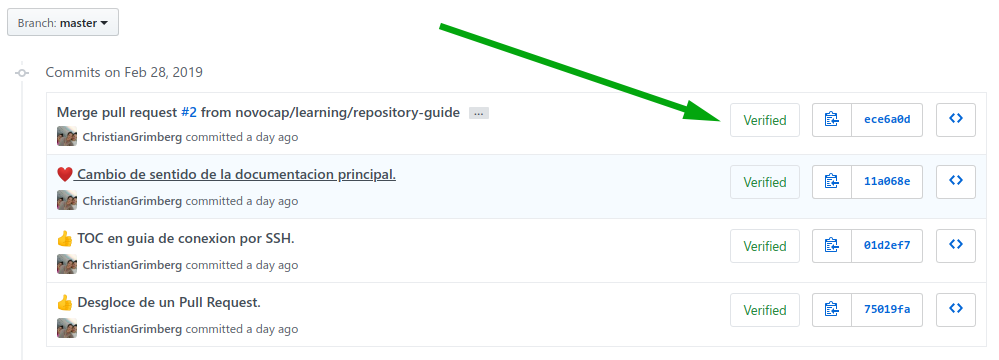
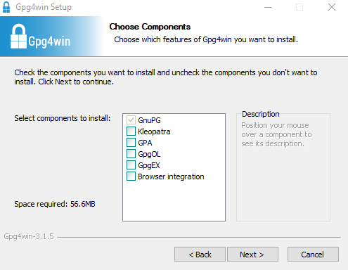
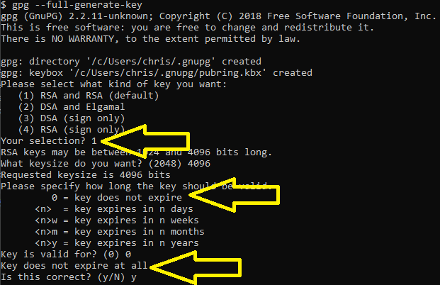
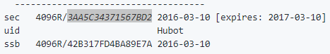

[<- Inicio](../README.md)

[Indice del Repositorio](SUMMARY.md)

<details>
    <summary>Tabla de contenido</summary>
    <a href="#Confirmación-de-cambios-firmados-en-Git"><strong>Confirmación de cambios firmados en Git</strong></a><br>
    <a href="#Descarga-de-herramienta-GPG">· Descarga de herramienta GPG</a><br>
    <a href="#Generación-de-llave-GPG">· Generación de llave GPG</a><br>
    <a href="#Vincular-la-llave-GPG-a-Git">· Vincular la llave GPG a Git</a><br>
</details>

# Confirmación de cambios firmados en Git
Hemos visto que para configurar el usuario y nuestra cuenta de correo en Git es verdaderamente muy simple. Entonces, ¿Qué sucedería si, por ejemplo, un usuario se configura una identidad no propia para guardar cambios en un determinado repositorio? Es evidente que de alguna manera u otra podría falsear la identidad de los cambios en el historial de versiones.

Para estos casos Git utiliza una herramienta de seguridad para firmar criptográficamente nuestras confirmaciones de cambios, validando y protegiendo nuestra identidad por Autor para tener un ambiente más seguro. Esta característica también es soportada por las plataformas de GitHub y GitLab, entre otras, y se puede observar el siguiente símbolo en cada `commit` realizado:


> __Imagen 1__: _Confirmaciones de cambio verificadas en GitHub._

[🡡 volver al inicio](#Confirmación-de-cambios-firmados-en-Git)
## Descarga de herramienta GPG
Podemos utilizar la herramienta para firmar las confirmaciones mediante el algoritmo [GPG](https://es.wikipedia.org/wiki/GNU_Privacy_Guard) llamada GnuPG. En el caso de Windows será necesario descargar la alternativa [Gpg4Win](https://gpg4win.org/download.html) para contar con la herramienta GnuPG, la cual la debemos seleccionar desde las opciones de instalación (_no es necesario tildar otra herramienta_):


> __Imagen 2__: _Instalación de GnuPG en Windows._

Mientras tanto, en Linux lo podemos hacer ejecutando simplemente el siguiente comando:
```bash
sudo apt-get install gpg -y
```
[🡡 volver al inicio](#Confirmación-de-cambios-firmados-en-Git)
## Generación de llave GPG
Una vez que contamos con GnuPG, vamos a crear una llave para cifrar y firmar las confirmaciones que realicemos en el repositorio, y esto lo vamos a hacer desde el aplicación __Git Bash__ en Windows, y desde la terminal en Linux. De esta manera, pasamos a generar la llave:
```bash
gpg --full-generate-key
```
La generación de la llave va a necesitar de varios parámetros los cuáles debemos seleccionar los siguientes:


> __Imagen 3__: _Opciones para generar la llave GPG._

Luego nos consultará nuestro Nombre y Apellido, correo electrónico (_preferentemente el que usamos con la cuenta de GitHub_) y una descripción de la llave, que si cargamos todo bien debemos presionar la __O__ en mayúscula para indicar que esta todo OK.

A partir de ahí comenzará a generar la llave, consultándonos una contraseña para protegerla. Esta tarea puede llevar varios minutos por la encriptación elegida, y es importante no parar el proceso, ya que de lo contrario tendremos que volver a generarla.

[🡡 volver al inicio](#Confirmación-de-cambios-firmados-en-Git)
## Subir la llave GPG a GitHub
Ahora debemos vincular la llave GPG que creamos localmente en la PC con la plataforma de GitHub/Gitlab, y para ello necesitaremos contar con el ID de la llave ejecutando el siguiente comando:
```bash
gpg --list-secret-keys --keyid-format LONG
```
Este comando nos mostrará el encabezado de la llave GPG, y dentro de él tendremos el ID que debemos copiarnos, según se muestra en la siguiente imagen de ejemplo:


> __Imagen 4__: _ID de llave GPG._

El ID nos servirá para ejecutar el comando que nos imprimirá en pantalla la llave GPG en modo ASCII:
```bash
gpg --armor --export <--ID-llave-GPG-->
```
Ahora tenemos que seleccionar todo el contenido impreso en pantalla desde `-----BEGIN PGP PUBLIC KEY BLOCK-----` hasta `-----END PGP PUBLIC KEY BLOCK-----`, y copiarlo al portapapeles.

En GitHub nos dirigimos a [Settings -> SSH and GPG keys -> New GPG Key](https://github.com/settings/gpg/new), mientras que en GitLab lo hacemos desdes [Settings -> GPG Key ->](https://gitlab.com/profile/gpg_keys), y ahí copiamos el contenido del portapeles para agregarla.
> Por seguridad se recomienda copiar otro texto al portapapeles inmediatamente finalicemos este paso.

[🡡 volver al inicio](#Confirmación-de-cambios-firmados-en-Git)
## Vincular la llave GPG a Git
En este paso necesitaremos indicarle a nuestro entorno local con Git que llave GPG tenemos creada para que podamos firmar y encriptar nuestros ``commit` por ejemplo. Para esto necesitaremos de nuevo el ID de la llave:
```bash
gpg --list-secret-keys --keyid-format LONG
```
Nos copiamos el ID para ejecutar el siguiente comando:
```git
git config --global user.signingkey <--ID-llave-GPG-->
```
A partir de este momento podemos firmar nuestras confirmaciones (`commit`) con el párametro `-S` según el ejemplo a continuación:
```git
git commit -S -m "Confirmacion de cambio firmado con GPG."
```
También podemos firmar las fusiones entre ramas con la confirmación (`commit`) resultante, utilizando el mismo parámetro:
```git
git merge -S origin <--rama-a-fusionar--> 
```
Este último caso es útil y necesario cuando el repositorio en GitHub obligue a fusionar ramas protegidas (_ver la documentación de [ Fundamentos de Git y GitHub](GIT.md)_) con cambios firmados, aumentando la seguridad sobre el circuito de control de cambios en esta plataforma. Además cuando fusionemos ramas de manera local, podremos utilizar el parámtero `--verify-signatures` que sólo permitirá realizar la mezcla si todos sus `commit` están firmados:
```git
git merge --verify-signatures -S  signed-branch
```
[🡡 volver al inicio](#Confirmación-de-cambios-firmados-en-Git)