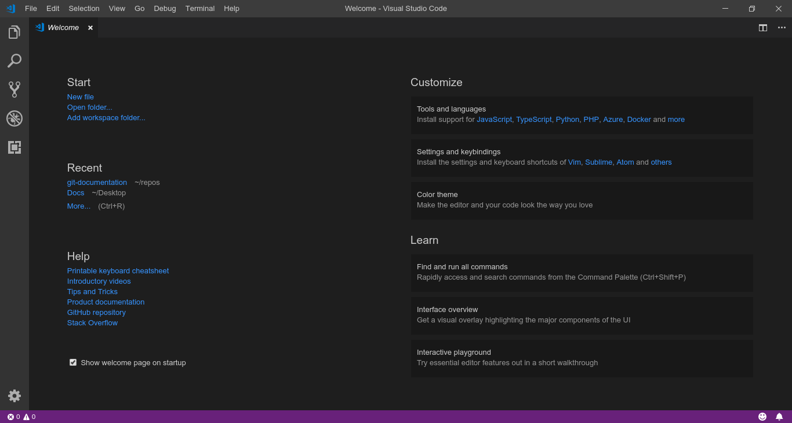
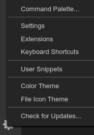
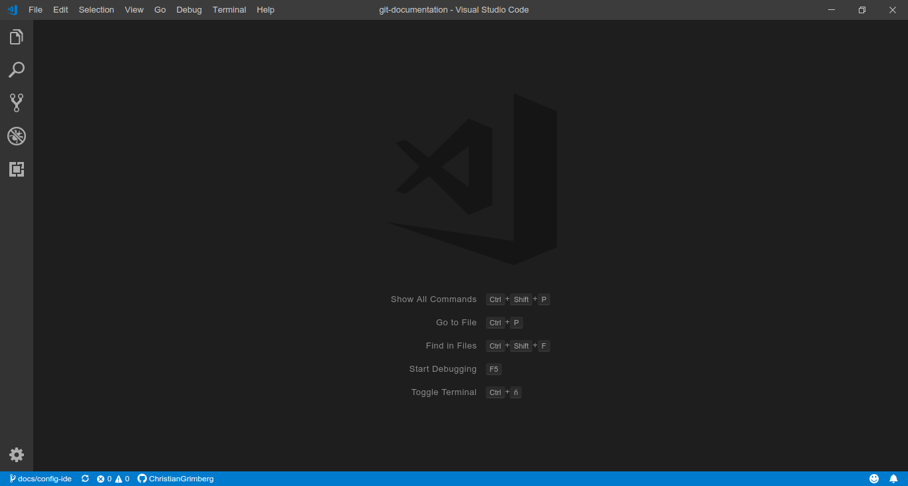
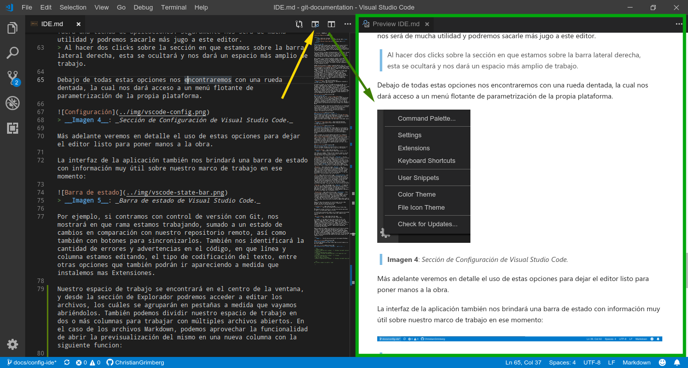
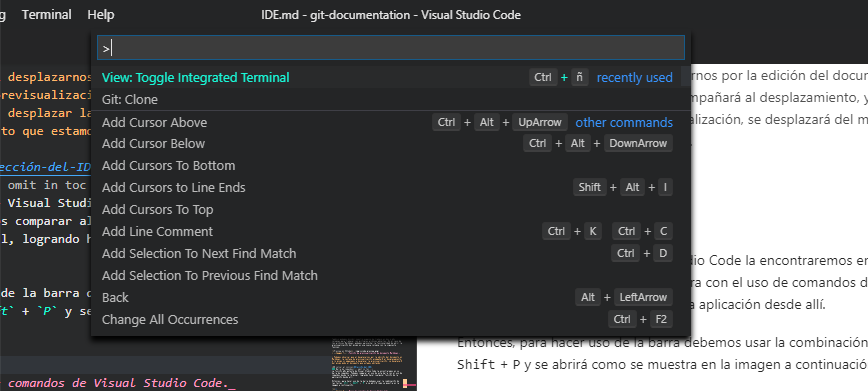

[<- Inicio](../README.md)

[Indice del Repositorio](SUMMARY.md)

<details>
    <summary>Tabla de contenido</summary>
    <a href="#Elección-del-IDE"><strong>Elección del IDE</strong></a><br>
    <a href="#Visual-Studio-Code">· Visual Studio Code</a><br>
</details>

# Elección del IDE
Indistintamente del proyecto que trabajemos, será necesario definir un marco de trabajo analizando las diferentes alternativas que tengamos para hacerlo. Antes de comenzar es importante tomarse el debido tiempo de análisis para evaluar las ventajas y desventajas de cada modelo, para que tengamos claro que podremos hacer y que no con la opción que definamos.

En el caso de Git, ya hemos configurado desde el terminal de línea de comandos su parametrización inicial de forma local, y también nos conectamos de manera segura con nuestros repositorios remotos en GitHub/GitLab. De esta manera hemos configurado nuestro entorno de trabajo de manera centralizada y distribuida con Git.

Para trabajar con un proyecto documental usando la tecnología de Markdown, lo podemos realizar simplemente desde un editor de texto plano y junto a la execución de comandos Git desde la terminal. La variedad de editores de texto que contamos hoy día es vasta, y las interfaces de uso son simples, funcionales y de buen rendimiento por el bajo consumo de recursos.

Además de este escenario, tenemos la posibilidad de contar con [Entornos de Desarrollo Integrados IDE](https://es.wikipedia.org/wiki/Entorno_de_desarrollo_integrado) que tienen incorporadas todas estas funcionalidades en una misma herramienta, sumado a otras opciones que pueden resultarnos últiles en el día a día.
> También contamos con editores de texto plano desarrollados hace muchos años atrás, que fueron confeccionados para la interfaz de línea de comandos. Lo interesante es que siguen siendo muy utilizandos hoy día por su rendimiento y productividad. Pueden investigar sobre el uso de complementos con las aplicaciones de consola de Emacs y Vim, y confeccionar entornos IDE muy potentes y eficientes (_sobretodo sin levantar la mano del teclado para interactuar con ellos, y así podés deshacerte directamente del períferico del mouse :scream:_).


>__Imagen 1__: _Editor de consola Vim con complementos logrando un interfaz similar a los IDE's actuales._

Actualmente contamos con una infinidad de opciones de IDE's en el mercado, y debemos evaluar una opción u otra dependeniendo del lenguaje y del proyecto que vamos a realizar; por lo cual, en el caso que definamos trabajar con un IDE para documentar, será necesario analizar que opciones existentes trabajan con la tecnología de Markdown, filtrando por aquellos que se integren con Git y permitan conectarse con GitHub. En las próximas secciones del documento iremos viendo algunas alternativas que recomendamos, aunque igualmente la elección dependerá del gusto de cada uno.

[🡡 volver al inicio](#Elección-del-IDE)
## Visual Studio Code
Desarrollado por Microsoft, [Visual Studio Code](https://code.visualstudio.com/) es uno de los IDE más utilizados hoy día por su amplio soporte a una gran cantidad de lenguajes de programación, frameworks, librerías y utilidades; además de ser de uso gratuito siguiendo el estandar de desarrollo de software libre, el cual es mantenido periódicamente con actualizaciones de versiones cada mes, y por sobretodo es multiplataforma tanto para sistemas Linux, Windows y MacOS.

Por defecto este editor tiene una alta integración con la instalación local de Git, además de contar con una previsualización en vivo para editar documentos en Markdown y contando con extensiones para comunicarnos directamente con varias funciones de GitHub, convirtiéndolo en una de las mejores opciones para comenzar a trabajar con proyectos de esta índole.

[🡡 volver al inicio](#Elección-del-IDE)
### Descarga de la aplicación<!-- omit in toc -->
Para descargarnos una copia nos dirigimos a su sitio de [descargas](https://code.visualstudio.com/#alt-downloads) y elegimos el sistema operativo que usamos. Podremos notar que su instalador no es de gran tamaño y no necesita de grandes [requerimientos](https://code.visualstudio.com/docs/supporting/requirements) para poder operar con él.


> __Imagen 2__: _Descarga de Visual Studio Code para diferentes sistemas operativos._

[🡡 volver al inicio](#Elección-del-IDE)
### Instalación<!-- omit in toc -->
Las opciones de descarga de Visual Studio Code en su sitio público son archivos auto-instalables, los cuáles podrán ser gestionados por medio de los respectivos administradores de paquetes de instalación que incluye cada sistema operativo, por lo cual no tendremos inconvenientes durante su instalación y esta será prácticamente guíada.

También contamos con la posibilidad de descargarnos el código de desarrollo de la propia aplicación alojada en el [repositorio de Visual Studio Code en GitHub](https://github.com/Microsoft/vscode), y a partir de allí seguir los pasos para compilarlo en nuestras PC poder utilizarlo a partir del ensamblado creado. Esta opción solo es recomendable si queremos aprovechar las nuevas funcionalidades y correcciones que salen a diario (_aunque con poco testeo de las mismas_), o en el caso que directamente queramos contribuir con el desarrollo de la solución.

[🡡 volver al inicio](#Elección-del-IDE)
### Interfaz de usuario<!-- omit in toc -->
Una vez instalado, ubicamos el acceso directo a la aplicacion y al inciarla nos dará la bienvenida como se muestra a continuación:


> __Imagen 3__: _Bienvenida de Visual Studio Code versión 1.31.1_

Como vemos en la imagen, tenemos una barra de menú superior con una gran cantidad de opciones, y sobre la barra del lateral izquierda tendremos acceso a las siguientes opciones:

 __Explorador__: En esta sección podremos seleccionar y trabajar con nuestro arbol de archivos abriendo un directorio, o también podemos abrir un archivo directamente sin ningún contenedor. Adicionalmente nos mostrará que archivos tenemos abiertos o estamos trabajando, y contaremos con una herramienta de previsualización documentos de Markdown (_igualmente este tema lo abordaremos más adelante_). Más abajo tenemos otra opción llamada __Entorno__ que nos brindará accesos rápidos a las secciones de nuestro código sobre la ventana que estemos trabajando.

 __Buscador__: Aquí nos encontraremos con un potente buscador de bloques de código sobre todos los archivos contenidos en la sección del Explorador, el cual también nos dará la posibilidad de reemplazar sus valores. Cuando presionamos sobre un valor encontrado, el editor nos posicionará directamente en el archivo y en la línea que marcamos, lo cual nos puede servir de mucha ayuda en más de una ocasión.

 __Control de Fuente__: Aquí nos encontraremos con una interfaz gráfica integrada para nuestra instalación de Git local, y nos permitirá ahorrarnos del uso de los comandos de consola de Git si así lo quisiéramos. Es excelente para ver las diferencias entre archivos que hayamos o estemos editando, así como también para mantenernos sincronizados con nuestro repositorio remoto en GitHub/GitLab. Sólo funciona si tenemos instalado Git en nuestra PC, y la raíz del directorio abierto en la sección del Explorador tiene que contar con control de versión de Git.

 __Depurador__: El depurador es una herramienta muy potente para inspeccionar la ejecución de nuestras líneas de código durante su ciclo de vida. Es muy útil para poder analizar o encontrar problemas. No tendremos uso si nos manejamos con repositorios documentales, aunque dependerá igualmente de las funcionalidades que le agreguemos a estos.

 __Extensiones__: Esta sección es muy interesante, la cual nos permitirá agregar funcionalidades adicionales, trabajar con otros lenguajes, instalar frameworks, entre otras opciones, de forma rápida y ágil como si fuera una tienda de aplicaciones. Seguramente nos será de mucha utilidad y podremos sacarle más jugo a este editor.
> Al hacer dos clicks sobre la sección en que estamos sobre la barra lateral derecha, esta se ocultará y nos dará un espacio más amplio de trabajo.

Debajo de todas estas opciones nos encontraremos con una rueda dentada, la cual nos dará acceso a un menú flotante de parametrización de la propia plataforma.


> __Imagen 4__: _Sección de Configuración de Visual Studio Code._

Más adelante veremos en detalle el uso de estas opciones para dejar el editor listo para poner manos a la obra.

La interfaz de la aplicación también nos brindará una barra de estado con información muy útil sobre nuestro marco de trabajo en ese momento:


> __Imagen 5__: _Barra de estado de Visual Studio Code._

Por ejemplo, si contramos con control de versión con Git, nos mostrará en que rama estamos trabajando, sumado a un estado de cambios en comparación con nuestro repositorio remoto, así como también con botones para sincronizarlos. También nos identificará la cantidad de errores y advertencias en el código, en que línea y columna estamos editando, el tipo de codificación del texto, entre otras opciones que también podrán ir apareciendo a medida que instalemos mas Extensiones.

Nuestro espacio de trabajo se encontrará en el centro de la ventana, y desde la sección de Explorador podremos acceder a editar los archivos, los cuáles se agruparán en pestañas a medida que vayamos abriéndolos.


> __Imagen 6__: _Espacio de trabajo de Visual Studio Code._

> Si presionamos las teclas `Ctrl` + `N` se nos abrirá un nuevo archivo para comenzar a trabajar, para luego definir donde lo guardaremos.

También podemos dividir nuestro espacio de trabajo en dos o más columnas para trabajar con múltiples archivos abiertos. En el caso de los archivos Markdown, podemos aprovechar la funcionalidad de abrir la previsualización del mismo en una nueva columna con la siguiente funcion:


> __Imagen 7__: _Función de previsualización de documento Markdown._

> Podemos observar que al desplazarnos por la edición del documento en Markdown, la ventana de previsualización acompañará al desplazamiento, y lo mismo si empezamos a desplazar la previsualización, se desplazará del mismo modo el documento que estamos editando.

[🡡 volver al inicio](#Elección-del-IDE)
### Barra de comandos<!-- omit in toc -->
La función más potente de Visual Studio Code la encontraremos en su barra de comandos. Podemos comparar al uso de esta barra con el uso de comandos desde la terminal, logrando hacer cualquier función de la aplicación desde allí.

Entonces, para hacer uso de la barra debemos usar la combinación de las teclas `Ctrl` + `Shift` + `P` y se abrirá como se muestra en la imagen a continuación:


> __Imagen 8__: _Barra de comandos de Visual Studio Code._

[🡡 volver al inicio](#Elección-del-IDE)
### Configuración del Terminal Integrado<!-- omit in toc -->
<!--
```json
// Command Prompt
"terminal.integrated.shell.windows": "C:\\Windows\\System32\\cmd.exe"
// PowerShell
"terminal.integrated.shell.windows": "C:\\Windows\\System32\\WindowsPowerShell\\v1.0\\powershell.exe"
// Git Bash
"terminal.integrated.shell.windows": "C:\\Program Files\\Git\\bin\\bash.exe"
// Bash on Ubuntu (on Windows)
"terminal.integrated.shell.windows": "C:\\Windows\\System32\\bash.exe"
```

```git
git config --global core.editor "code"
```
-->