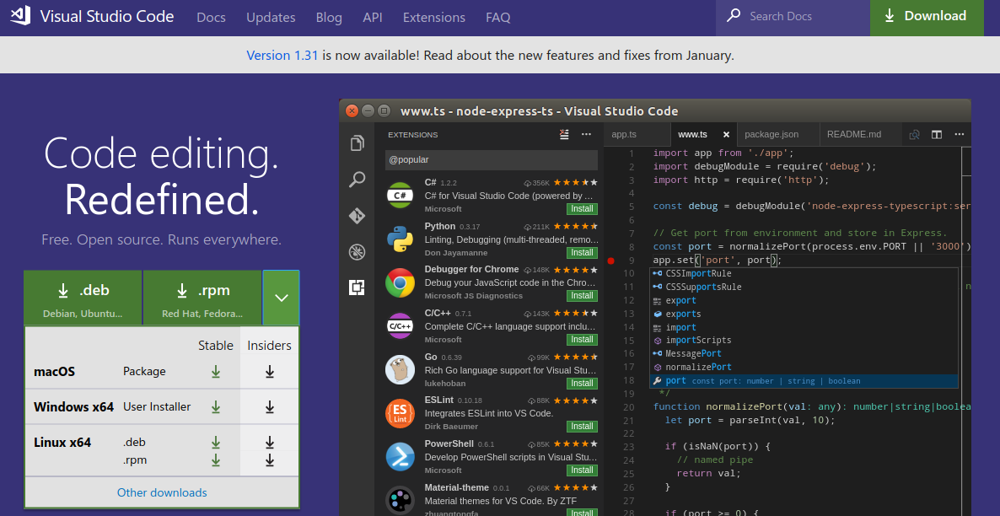

[<- Inicio](../README.md)

[Indice del Repositorio](SUMMARY.md)

<details>
    <summary>Tabla de contenido</summary>
    <a href="#Elección-del-IDE"><strong>Elección del IDE</strong></a><br>
    <a href="#Visual-Studio-Code">· Visual Studio Code</a><br>
</details>

# Elección del IDE
Indistintamente del proyecto que trabajemos, será necesario definir un marco de trabajo analizando las diferentes alternativas que tengamos para hacerlo. Antes de comenzar es importante tomarse el debido tiempo de análisis para evaluar las ventajas y desventajas de cada modelo, para que tengamos claro que podremos hacer y que no con la opción que definamos.

En el caso de Git, ya hemos configurado desde el terminal o línea de comandos su parametrización inicial de forma local, y también nos conectamos de manera segura con nuestros repositorios remotos en GitHub/GitLab. De esta manera hemos configurado nuestro entorno de trabajo de manera centralizada y distribuida con Git.

Para trabajar con un proyecto documental usando la tecnología de Markdown, lo podemos realizar simplemente desde un editor de texto plano y desde comandos desde el terminal. La variedad de editores de texto que contamos hoy día es vasta, y las interfaces de uso son simples, funcionales y de buen rendimiento por el bajo consumo de recursos. Existen editores de texto desde la propia línea de comandos que cuentan con una interfaz que se gestiona por atajos de teclado en su mayoría, independizándose del uso del mouse para ganar tiempo, aunque lleva tiempo de adopción, y posiblemente algunos lo consideren complejo utilizarlo en el día a día.

Además del escenario de los editores de texto sumado a la terminal de línea de comandos, tenemos la posibilidad de contar con [Entornos de Desarrollo Integrados IDE](https://es.wikipedia.org/wiki/Entorno_de_desarrollo_integrado) que pueden contar con estas opciones integradas en la misma herramienta, sumado a otras opciones que pueden resultarnos últiles en el día a día.

En el caso de los IDE, existen una infinidad de opciones y debemos evaluar una opción u otra dependeniendo del lenguaje y del proyecto que vamos a realizar, por lo cual, en el caso que definamos trabajar con un IDE para documentar bajo Markdown, será necesario analizar que opciones tenemos en el mercado que trabajen con esta tecnología, filtrando por aquellos que se integran con Git y permitan conectarse con GitHub. En las próximas secciones del documento iremos viendo algunas alternativas que recomendamos, aunque igualmente dependerá del gusto de cada uno.
[🡡 volver al inicio](#Elección-del-IDE)
## Visual Studio Code
[Visual Studio Code](https://code.visualstudio.com/) es un producto desarrollado por Microsoft, siendo uno de los IDE más utilizados hoy día por la comunidad de desarrollo, teniendo en cuenta su integridad con gran cantidad de lenguajes, frameworks y utilidades, además de ser de uso gratuito bajo un desarrollo de software libre; mantenido con una perioricidad de actualización de versiones finales prácticamente mensuales, y además es multiplataforma tanto para sistemas Linux, Windows y MacOS.

Por defecto este editor tiene una alta integración con la instalación local de Git, además de contar con una previsualización en vivo para editar documentos en Markdown, contando con extensiones para comunicarnos directamente con varias funciones de GitHub, por lo cual lo hace uno de las mejores opciones para comenzar con proyectos de esta índole.

### Descarga de Visual Studio Code<!-- omit in toc -->
Para descargarnos una copia nos dirigimos al su sitio de [descargas](https://code.visualstudio.com/#alt-downloads) y elegimos el sistema operativo que usamos. Podremos notar que su instalador no es de gran tamaño y no necesita de grandes [requerimientos](https://code.visualstudio.com/docs/supporting/requirements) para poder operar con él.


> __Imagen 1__: _Descarga de Visual Studio Code para diferentes sistemas operativos._

[🡡 volver al inicio](#Elección-del-IDE)
### Instalación y puesta a punto de Visual Studio Code<!-- omit in toc -->
[🡡 volver al inicio](#Elección-del-IDE)
### Configuración del Terminal Integrado<!-- omit in toc -->
<!--
```json
// Command Prompt
"terminal.integrated.shell.windows": "C:\\Windows\\System32\\cmd.exe"
// PowerShell
"terminal.integrated.shell.windows": "C:\\Windows\\System32\\WindowsPowerShell\\v1.0\\powershell.exe"
// Git Bash
"terminal.integrated.shell.windows": "C:\\Program Files\\Git\\bin\\bash.exe"
// Bash on Ubuntu (on Windows)
"terminal.integrated.shell.windows": "C:\\Windows\\System32\\bash.exe"
```

```git
git config --global core.editor "code"
```
-->