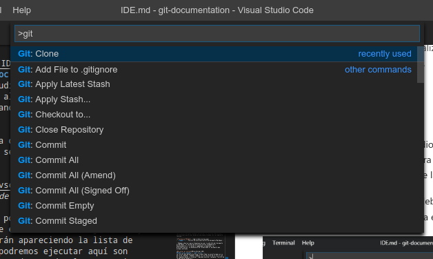
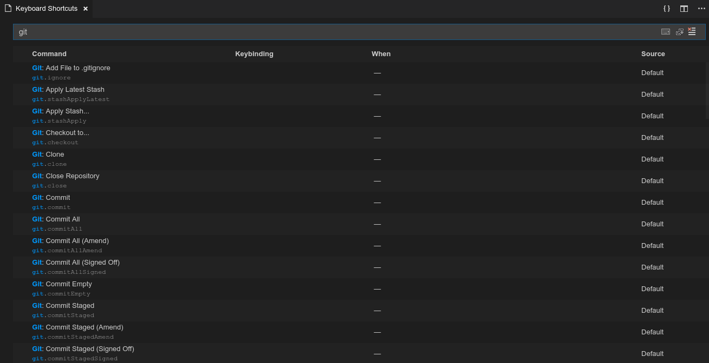
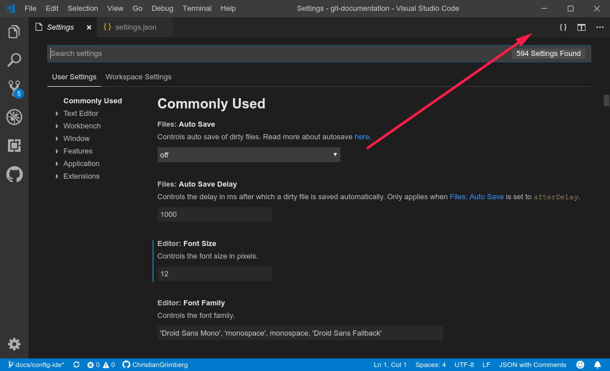
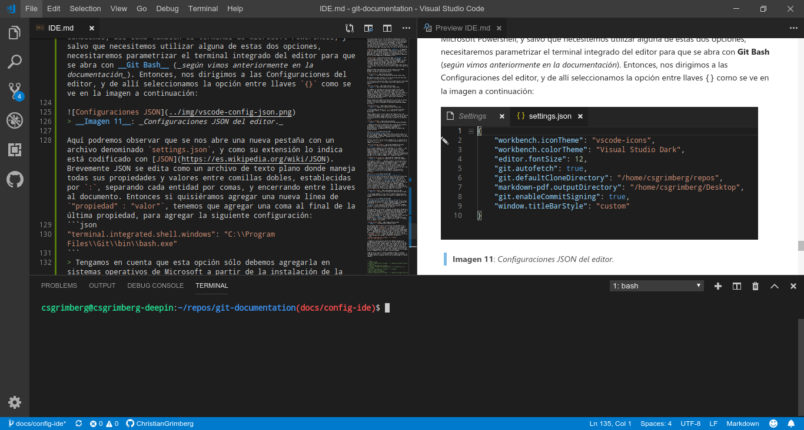

[<- Inicio](../README.md)

[Indice del Repositorio](SUMMARY.md)

<details>
    <summary>Tabla de contenido</summary>
    <a href="#IDE-con-Visual-Studio-Code"><strong>IDE con Visual Studio Code</strong></a><br>
    <a href="#Introducción-a-Visual-Studio-Code">· Introducción a Visual Studio Code</a><br>
</details>

# IDE con Visual Studio Code
Indistintamente del proyecto que trabajemos, será necesario definir un marco de trabajo analizando las diferentes alternativas que tengamos para hacerlo. Antes de comenzar es importante tomarse el debido tiempo de análisis para evaluar las ventajas y desventajas de cada modelo, para que tengamos claro que podremos hacer y que no con la opción que definamos.

En el caso de Git, ya hemos configurado desde el terminal de línea de comandos su parametrización inicial de forma local, y también nos conectamos de manera segura con nuestros repositorios remotos en GitHub/GitLab. De esta manera hemos configurado nuestro entorno de trabajo de manera centralizada y distribuida con Git.

Para trabajar con un proyecto documental usando la tecnología de Markdown, lo podemos realizar simplemente desde un editor de texto plano y junto a la execución de comandos Git desde la terminal. La variedad de editores de texto que contamos hoy día es vasta, y las interfaces de uso son simples, funcionales y de buen rendimiento por el bajo consumo de recursos.

Además de este escenario, tenemos la posibilidad de contar con [Entornos de Desarrollo Integrados IDE](https://es.wikipedia.org/wiki/Entorno_de_desarrollo_integrado) que tienen incorporadas todas estas funcionalidades en una misma herramienta, sumado a otras opciones que pueden resultarnos últiles en el día a día.
> También contamos con editores de texto plano desarrollados hace muchos años atrás, que fueron confeccionados para la interfaz de línea de comandos. Lo interesante es que siguen siendo muy utilizandos hoy día por su rendimiento y productividad. Pueden investigar sobre el uso de complementos con las aplicaciones de consola de Emacs y Vim, y confeccionar entornos IDE muy potentes y eficientes (_sobretodo sin levantar la mano del teclado para interactuar con ellos, y así podés deshacerte directamente del períferico del mouse :scream:_).


>__Imagen 1__: _Editor de consola Vim con complementos logrando un interfaz similar a los IDE's actuales._

Actualmente contamos con una infinidad de opciones de IDE's en el mercado, y debemos evaluar una opción u otra dependeniendo del lenguaje y del proyecto que vamos a realizar; por lo cual, en el caso que definamos trabajar con un IDE para documentar, será necesario analizar que opciones existentes trabajan con la tecnología de Markdown, filtrando por aquellos que se integren con Git y permitan conectarse con GitHub. En las próximas secciones del documento iremos viendo algunas alternativas que recomendamos, aunque igualmente la elección dependerá del gusto de cada uno.

[🡡 volver al inicio](#IDE-con-Visual-Studio-Code)
## Introducción a Visual Studio Code
Desarrollado por Microsoft, [Visual Studio Code](https://code.visualstudio.com/) es uno de los IDE más utilizados hoy día por su amplio soporte a una gran cantidad de lenguajes de programación, frameworks, librerías y utilidades; además de ser de uso gratuito siguiendo el estandar de desarrollo de software libre, el cual es mantenido periódicamente con actualizaciones de versiones cada mes, y por sobretodo es multiplataforma tanto para sistemas Linux, Windows y MacOS.

Por defecto este editor tiene una alta integración con la instalación local de Git, además de contar con una previsualización en vivo para editar documentos en Markdown y contando con extensiones para comunicarnos directamente con varias funciones de GitHub, convirtiéndolo en una de las mejores opciones para comenzar a trabajar con proyectos de esta índole.

[🡡 volver al inicio](#IDE-con-Visual-Studio-Code)
### Descarga de la aplicación<!-- omit in toc -->
Para descargarnos una copia nos dirigimos a su sitio de [descargas](https://code.visualstudio.com/#alt-downloads) y elegimos el sistema operativo que usamos. Podremos notar que su instalador no es de gran tamaño y no necesita de grandes [requerimientos](https://code.visualstudio.com/docs/supporting/requirements) para poder operar con él.


> __Imagen 2__: _Descarga de Visual Studio Code para diferentes sistemas operativos._

[🡡 volver al inicio](#IDE-con-Visual-Studio-Code)
### Instalación<!-- omit in toc -->
Las opciones de descarga de Visual Studio Code en su sitio público son archivos auto-instalables, los cuáles podrán ser gestionados por medio de los respectivos administradores de paquetes de instalación que incluye cada sistema operativo, por lo cual no tendremos inconvenientes durante su instalación y esta será prácticamente guíada.

También contamos con la posibilidad de descargarnos el código de desarrollo de la propia aplicación alojada en el [repositorio de Visual Studio Code en GitHub](https://github.com/Microsoft/vscode), y a partir de allí seguir los pasos para compilarlo en nuestras PC poder utilizarlo a partir del ensamblado creado. Esta opción solo es recomendable si queremos aprovechar las nuevas funcionalidades y correcciones que salen a diario (_aunque con poco testeo de las mismas_), o en el caso que directamente queramos contribuir con el desarrollo de la solución.

[🡡 volver al inicio](#IDE-con-Visual-Studio-Code)
### Interfaz de usuario<!-- omit in toc -->
Una vez instalado, ubicamos el acceso directo a la aplicacion y al inciarla nos dará la bienvenida como se muestra a continuación:


> __Imagen 3__: _Bienvenida de Visual Studio Code versión 1.31.1_

Como vemos en la imagen, tenemos una barra de menú superior con una gran cantidad de opciones, y sobre la barra del lateral izquierda tendremos acceso a las siguientes opciones:

 __Explorador__: En esta sección podremos seleccionar y trabajar con nuestro arbol de archivos abriendo un directorio, o también podemos abrir un archivo directamente sin ningún contenedor. Adicionalmente nos mostrará que archivos tenemos abiertos o estamos trabajando, y contaremos con una herramienta de previsualización documentos de Markdown (_igualmente este tema lo abordaremos más adelante_). Más abajo tenemos otra opción llamada __Entorno__ que nos brindará accesos rápidos a las secciones de nuestro código sobre la ventana que estemos trabajando.

 __Buscador__: Aquí nos encontraremos con un potente buscador de bloques de código sobre todos los archivos contenidos en la sección del Explorador, el cual también nos dará la posibilidad de reemplazar sus valores. Cuando presionamos sobre un valor encontrado, el editor nos posicionará directamente en el archivo y en la línea que marcamos, lo cual nos puede servir de mucha ayuda en más de una ocasión.

 __Control de Fuente__: Aquí nos encontraremos con una interfaz gráfica integrada para nuestra instalación de Git local, y nos permitirá ahorrarnos del uso de los comandos de consola de Git si así lo quisiéramos. Es excelente para ver las diferencias entre archivos que hayamos o estemos editando, así como también para mantenernos sincronizados con nuestro repositorio remoto en GitHub/GitLab. Sólo funciona si tenemos instalado Git en nuestra PC, y la raíz del directorio abierto en la sección del Explorador tiene que contar con control de versión de Git.

 __Depurador__: El depurador es una herramienta muy potente para inspeccionar la ejecución de nuestras líneas de código durante su ciclo de vida. Es muy útil para poder analizar o encontrar problemas. No tendremos uso si nos manejamos con repositorios documentales, aunque dependerá igualmente de las funcionalidades que le agreguemos a estos.

 __Extensiones__: Esta sección es muy interesante, la cual nos permitirá agregar funcionalidades adicionales, trabajar con otros lenguajes, instalar frameworks, entre otras opciones, de forma rápida y ágil como si fuera una tienda de aplicaciones. Seguramente nos será de mucha utilidad y podremos sacarle más jugo a este editor.
> Al hacer dos clicks sobre la sección en que estamos sobre la barra lateral derecha, esta se ocultará y nos dará un espacio más amplio de trabajo.

Debajo de todas estas opciones nos encontraremos con una rueda dentada, la cual nos dará acceso a un menú flotante de parametrización de la propia plataforma.


> __Imagen 4__: _Sección de Configuración de Visual Studio Code._

Más adelante veremos en detalle el uso de estas opciones para dejar el editor listo para poner manos a la obra.

La interfaz de la aplicación también nos brindará una barra de estado con información muy útil sobre nuestro marco de trabajo en ese momento:


> __Imagen 5__: _Barra de estado de Visual Studio Code._

Por ejemplo, si contramos con control de versión con Git, nos mostrará en que rama estamos trabajando, sumado a un estado de cambios en comparación con nuestro repositorio remoto, así como también con botones para sincronizarlos. También nos identificará la cantidad de errores y advertencias en el código, en que línea y columna estamos editando, el tipo de codificación del texto, entre otras opciones que también podrán ir apareciendo a medida que instalemos mas Extensiones.

Nuestro espacio de trabajo se encontrará en el centro de la ventana, y desde la sección de Explorador podremos acceder a editar los archivos, los cuáles se agruparán en pestañas a medida que vayamos abriéndolos.


> __Imagen 6__: _Espacio de trabajo de Visual Studio Code._

> Si presionamos las teclas `Ctrl` + `N` se nos abrirá un nuevo archivo para comenzar a trabajar, para luego definir donde lo guardaremos.

También podemos dividir nuestro espacio de trabajo en dos o más columnas para trabajar con múltiples archivos abiertos. En el caso de los archivos Markdown, podemos aprovechar la funcionalidad de abrir la previsualización del mismo en una nueva columna con la siguiente funcion:


> __Imagen 7__: _Función de previsualización de documento Markdown._

> Podemos observar que al desplazarnos por la edición del documento en Markdown, la ventana de previsualización acompañará al desplazamiento, y lo mismo si empezamos a desplazar la previsualización, se desplazará del mismo modo el documento que estamos editando.

[🡡 volver al inicio](#IDE-con-Visual-Studio-Code)
### Barra de comandos<!-- omit in toc -->
La función más potente de Visual Studio Code la encontraremos en su barra de comandos. Podemos comparar el uso de esta barra con el recurso de la ejecución comandos desde la terminal, logrando ejecutar cualquier función de la propia aplicación desde allí mismo.

Entonces, para hacer uso de la barra debemos usar la combinación de las teclas `Ctrl` + `Shift` + `P` y se abrirá una línea de comandos como se muestra a continuación:


> __Imagen 8__: _Barra de comandos de Visual Studio Code._

En la línea de comandos de la barra podremos ver el símbolo `>`, que significa que lo próximo que escribamos allí lo va a ejecutar, y mientras estemos escribiendo, nos irá apareciendo la lista de comandos disponibles basados en el criterio de búsqueda. Lo único que podremos ejecutar son comandos propios de la aplicación, sumado a todas las extensiones que integren comandos desde la barra del editor, por ejemplo, tenemos una gran cantidad de comandos Git que podremos verlo ni bien escribamos `git` luego del símbolo `>`:


> __Imagen 9__: _Comandos Git disponibles en la barra de comandos._

Si borramos el símbolo `>`, podremos acceder a las funciones que no son propias a las ejecuciones de comandos del editor, y a partir de aquí tendremos disponible la ayuda de la barra de comandos utilizando el símbolo `?`, o  en su defecto, podremos buscar e ir a archivos dentro del directorio que estemos trabajando. Además tenemos la opción de ir a una línea específica dentro de nuestros archivos, y acceder a las distintas funciones del menú y de la barra lateral izquierda de la propia aplicación.
> Si vamos adoptando el uso de la barra de comandos, nos va a permitir disminuir el uso del periférico del mouse, y podremos ser mas eficientes en lo que hagamos dentro del editor.

[🡡 volver al inicio](#IDE-con-Visual-Studio-Code)
### Accesos mediante combinaciones de teclado<!-- omit in toc -->
Otra de las funciones interesantes del editor de Visual Studio Code, son los accesos mediante el uso de la combinación de teclas del teclado. Si nos dirigimos a ícono de configuración del editor y accedemos a la opción de __Accesos de Teclado__, podremos ver una lista amplia de accesos, así como también modificarlas o agregar nuevas configuraciones a nuestro gusto. Como vimos en la sección anterior con la funcionalidad de la barra de comandos, podemos utilizar cualquiera de las opciones, comandos y utilidades que tenemos disponible en el editor, para asignarle una combinación de teclas y acceder más rápido a ellas. Seguramente nos puede servir de gran utilidad con las opciones que usemos con frecuencia.


> __Imagen 10__: _Accesos a la funciones de combinación de teclado._

> En la imagen podemos ver una lista filtrada de combinaciones de teclado disponibles para acceder directamente a comandos de Git por ejemplo.

[🡡 volver al inicio](#IDE-con-Visual-Studio-Code)
### Configuración del Terminal Integrado<!-- omit in toc -->
En sistemas operativos de Microsoft, podremos acceder a una ventana integrada de la terminal de línea de comandos usando la combinación de teclas de `Ctrl` + `Ñ`, o desde el menú desplegable de __Terminal__. En el caso que lo queramos hacer con Linux, podemos configurar la misma combinación de teclado como vimos en la sección anterior, ya que no viene configurado por defecto.

Antes de acceder a la terminal integrada, es importante configurarla previamente, sobretodo en los sistemas operativos de Microsoft. En el caso de Windows, sabemos que contiene un emulador de consola de MS-DOS desde sus inicios, así como también el terminal de Microsoft Powershell en versiones mas recientes del SO, y salvo que necesitemos utilizar alguna de estas dos opciones, para utilizar comandos de Git desde allí, debemos parametrizar el terminal integrado del editor para que se abra con __Git Bash__ (_según vimos anteriormente en la documentación_). Entonces, nos dirigimos a las Configuraciones del editor, y de allí seleccionamos la opción entre llaves `{}` como se ve en la imagen a continuación:


> __Imagen 11__: _Configuraciones JSON del editor._

Aquí podremos observar que se nos abre una nueva pestaña con un archivo denominado `settings.json`, y como su extensión lo indica está codificado con [JSON](https://es.wikipedia.org/wiki/JSON). Brevemente, JSON se edita como un archivo de texto plano donde gestiona todas sus propiedades y valores entre comillas dobles, que se establecen por `:`, separando cada entidad por comas, y finalmente, encerrando entre llaves al documento. Entonces si quisiéramos agregar una nueva línea de `"propiedad" : "valor"`, tenemos que agregar una coma al final de la última propiedad, para agregar la siguiente configuración:
```json
"terminal.integrated.shell.windows": "C:\\Program Files\\Git\\bin\\bash.exe"
```
> Tengamos en cuenta que esta opción sólo debemos agregarla en sistemas operativos de Microsoft a partir de la instalación de la aplicación de Git Bash. Veamos también que la doble barra invertida debemos utilizarla así para distinguir una sola barra invertida ya que justamente este símbolo es reservado por JSON. De nuevo, esto sólamente nos va a pasar si nuestro sistema operativo es Windows por el uso de la barra invertida para acceder a su arbol de directorios, y con sistemas basados en Unix como Linux y MacOSX sólo utilizaremos una barra diagonal normal sin ningún tipo de problemas.

Luego de cerrar y abrir el editor, podremos acceder al terminal integrado compatible con los comandos de Git y así poder experimentar el real poder de este sistema de control de versiones desde la línea de comandos :muscle:.


> __Imagen 12__: _Terminal integrado en Visual Studio Code._

En el caso que en Windows queramos utilizar el terminal integrado con la línea de comandos del emulador de MS-DOS o con Microsoft Powershell, tenemos que utilizar alguna de las dos opciones en la configuración `settings.json` como se muestra a continuación:
```json
// MS-DOS Command Prompt Emulator
"terminal.integrated.shell.windows": "C:\\Windows\\System32\\cmd.exe"
// PowerShell
"terminal.integrated.shell.windows": "C:\\Windows\\System32\\WindowsPowerShell\\v1.0\\powershell.exe"
```
Con Microsoft Windows 10 podremos hacer uso de [Windows Subsystem for Linux (WSL)](https://es.wikipedia.org/wiki/Windows_Subsystem_for_Linux), que nos brinda la posibilidad de utilizar Linux dentro del propio sistema operativo de Microsoft, brindándonos toda la potencia y rendimiento de sistemas Unix en él. En este caso, la configuración del terminal integrado debería ser así:
```json
// Bash into Windows from WSL
"terminal.integrated.shell.windows": "C:\\Windows\\System32\\bash.exe"
```
El recurso de WSL en Windows 10 podremos verlo en un documento aparte para ir mas en detalle con su parametrización, y contar con un entorno de desarrollo optimizado como los sistemas Unix.

[🡡 volver al inicio](#IDE-con-Visual-Studio-Code)