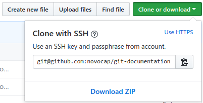

[<- Inicio](../README.md)

[Tabla de Contenidos](SUMMARY.md)
# Conexión SSH con GitHub
Para conectarnos con [GitHub](https://github.com) (esto también es válido con [GitLab](https://gitlab.com)), vamos a autenticarnos con [SSH](https://es.wikipedia.org/wiki/Secure_Shell) (Secure Shell) para tener una conexión validada entre sus servidores y nuestro equipo cliente. Si bien también podemos autenticarnos de la manera tradicional por __HTTPS__, la opción de conexión por SSH además nos dará la libertad de dejar autenticado el equipo cliente sin necesidad de ingresar usuario y contraseña cada vez que transferimos datos con esta plataforma.
> Es importante generar conexiones SSH únicamente en aquellos equipos de nuestra confianza y que usemos habitualmente, ya que en los casos que se utilice equipos de uso público o te encuentres conectado a redes no seguras, no es recomendado utilizar una conexión SSH perpetua y es preferible conectarse con HTTPS ingresando usuario y contraseña, o clave token en su defecto.

A continuación se explica paso a paso como establecer la conexión SSH tanto para las plataformas de Linux y Microsoft Windows.
## 1. Generar una llave SSH
La llave SSH es un archivo encriptado de identidad el cual es utilizado para conectarse remotamente entre servidores de manera segura por el protocolo SSH. Para lograr este cometido es necesario contar con la misma llave SSH en ambos extremos de la conexión, es decir el servidor al que nos queremos conectar debe contar con nuestra llave SSH generada en nuestro equipo. Para este caso en particular, tenemos que subir la llave SSH que generemos en el equipo para luego subirlo a los servidores de GitHub/GitLab y establecer el canal de comunicación verificado y seguro.
> Si ya tienes configurada una llave SSH en el equipo, por favor omití este paso.

Ten a mano la dirección de correo registrada en GitHub/GitLab y tu usuario (Nombre y Apellido) para generar la clave, registrando tu equipo con tu identidad en estas plataformas.

Ingresar el siguiente comando para generar una llave SSH encriptada en __RSA 4096__, la cual es válida tanto en el terminal de Linux, como en la aplicación de __Git Bash__ en Windows:
```bash
ssh-keygen -t rsa -b 4096 -C "tudirecciondecorreo@tudominio.com"
```
Presionar la tecla _Enter_ en este paso, aceptando guardar la llave SSH en la ubicación por defecto:
```bash
> Enter a file in which to save the key (~/.ssh/id_rsa): [Press enter]
```
Luego se pedirá ingresar la contraseña para finalizar la creación de la clave (Presionando sólo la tecla Enter la deja en blanco, lo cual no es recomendado):
```bash
> Enter passphrase (empty for no passphrase): [Type a passphrase]
> Enter same passphrase again: [Type passphrase again]
```
Al finalizar la creación de la llave SSH, será necesario agregar su referencia al Agente SSH del equipo. Para esto iniciamos el `ssh-agent` de la siguiente manera:
```bash
eval "$(ssh-agent -s)"
```
Aquí nos mostrará el ID de Proceso de ejecución del Agente SSH. Ahora vamos a agregar la llave SSH al agente referenciando su ubicación con el siguiente comando:
```bash
ssh-add ~/.ssh/id_rsa
```
## 2. Agregar la llave SSH a GitHub/GitLab
Para agregar la clave a GitHub/GitLab, es necesario previamente copiar todo el contenido de la llave SSH en texto plano. Usaremos la herramienta `xclip` en Linux, o `clip` en Windows, para copiar en nuestro portapapeles el contenido de la llave SSH.
> También se puede optar por utilizar un editor de texto plano para abrir el archivo ubicado en `~/.ssh/id_rsa` y copiar todo su contenido en el portapapeles.

La aplicación Git Bash en Windows ya viene con la herramienta `clip` preinstalada, y en el caso de Linux será necesario realizar la instalación de la herramienta `xclip` si aún no está instalada en el equipo con el siguiente comando:
```bash
sudo apt-get install xclip -y
```
Para copiar el contenido de la llave SSH en el portapapeles en Linux se efectua con el siguiente comando:
```bash
xclip -sel clip < ~/.ssh/id_rsa.pub
```
En Git Bash con Windows se realiza con el siguiente comando:
```bash
clip < ~/.ssh/id_rsa.pub
```
Al cargar el portapapeles con el contenido de la llave SSH, se deberá pegar su contenido dentro de [Settings / SSH and GPG Keys / New SSH Key](https://github.com/settings/ssh/new) dentro de Github, y [Settings / SSH Key](https://gitlab.com/profile/keys) dentro de GitLab.


> __Imagen 1__: _Agregar llaves SSH en GitHub y GitLab._

> Al finalizar, se recomienda pegar cualquier otro tipo de texto en el portapapeles para evitar que nuestra llave SSH quede vulnerada por un determinado periodo de tiempo.
## 3. Conectando por SSH por primera vez con GitHub/GitLab
Para probar la conexión, se colocar `yes` ejecutando el siguiente comando previamente:
* __GitHub__: `ssh -T git@github.com`
* __GitLab__: `ssh -T git@gitlab.com`

Si salió todo bien, GitHub y GitLab les dará un mensaje de bienvenida. Si hubo algún problema, por favor sírvase informarlo creando un [Issue](https://github.com/novocap/practice-markdown-documentation/issues/new) dentro del repositorio.
## 4. Próximos pasos
Ahora bien, ya tenemos efectuada la conexión con GitHub y GitLab por SSH, y a partir de este momento se recomienda operar con los repositorios remotos por medio de direcciones SSH.

Estas opciones se encuentran por ejemplo al Clonar un repositorio, que en vez de elegir la opción HTTPS, será preferible utilizar la opción SSH.


> __Imagen 2__: _Clonar un repositorio con SSH._

Otro ejemplo, es al momento de agregar la referencia al repositorio remoto dentro de los comandos locales de Git con la dirección SSH de clonación de GitHub/GitLab como también se mostraba en la imagen anterior. El siguiente comando sería un ejemplo con el repositorio actual:
```git
git remote add origin git@github.com:novocap/markdown-documentation.git
```
En un repositorio local ya vinculado con un repositorio remoto, se podrá observar la configuración con el siguiente comando:
```git
git remote -v
```
[Ir arriba](SSH.md#Conexión-SSH-con-GitHub)