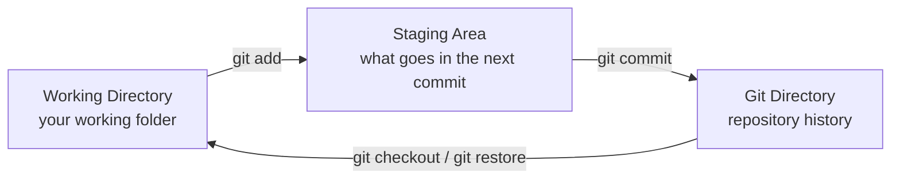
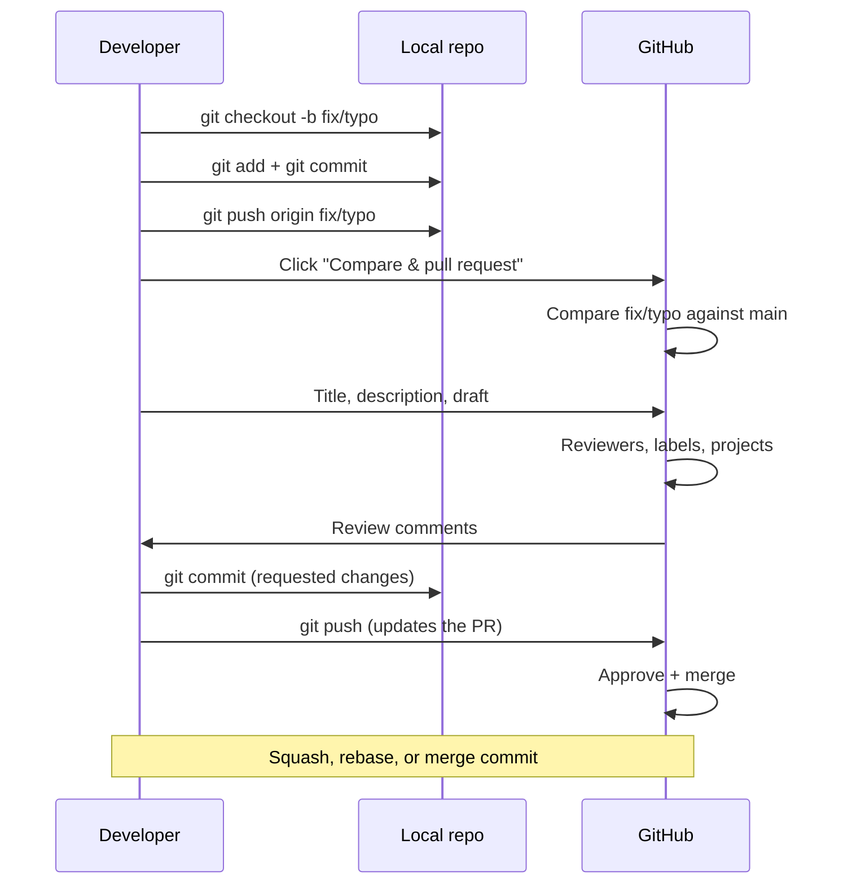

# Git and GitHub Fundamentals

Git is a **distributed version control system** that records changes
to a set of files over time. Unlike centralized systems, every clone
of a Git repository is a complete repository with the full history,
which lets you work offline and provides natural redundancy.

!!! note "Git is not GitHub"
    **Git** is the version control software. **GitHub**, GitLab,
    and Bitbucket are platforms that host Git repositories and add
    collaborative tools (Pull Requests, Issues, Actions). You can
    use Git without GitHub, and you can have repositories on GitHub
    that don't use Git (unusual, but possible).

## 1. The three states of Git

Git manages three areas where files live:



| State | What it represents | How to see it |
|---|---|---|
| **Working Directory** | Your working copy. Files as they are on disk. | `git status` shows files as *modified* or *untracked*. |
| **Staging Area** (also called *index*) | What will be included in the next commit. | `git status` shows *Changes to be committed*. |
| **Git Directory** (`.git/`) | The versioned history. Only Git touches it. | What you see with `git log`. |

!!! tip "The staging area is optional but powerful"
    It lets you prepare a logical commit across multiple edits,
    adding files to staging as they become ready, and making a
    single commit when everything is coherent.

### Essential commands

```bash
# See the current state
git status

# Move files from WD to staging
git add file.txt
git add docs/           # a folder
git add -A              # all modified/new files

# Confirm the staged changes
git commit -m "Descriptive message of the change"

# Take a file out of staging (without losing the changes)
git restore --staged file.txt

# Discard changes in the WD (careful, it's destructive!)
git restore file.txt

# See the history
git log
git log --oneline
git log --graph --oneline --all
```

## 2. Initialize a repository

To start versioning a folder:

```bash
cd my-project
git init
```

Git creates a hidden subdirectory `.git/` with all the repository's
metadata. From that moment, that folder is a Git repository.

!!! tip "Clone vs init"
    - `git init` converts an existing folder into a repository.
    - `git clone <url>` downloads a copy of a remote repository.

## 3. Confirm changes (`commit`)

A commit is a **snapshot** of the staging area's state at a given
moment, identified by a unique SHA-1 hash.

```bash
git commit -m "Add search function"
```

!!! tip "Commit messages"
    - Use the imperative: "Add", "Fix", "Remove", not "Added" or
      "Was added".
    - First line of 50 characters or less.
    - Blank line and a longer description if needed.
    - More details in the
      [`commit-conventional` skill][commit-skill] of the repository
      (gitmoji convention).

[commit-skill]: https://github.com/novocap/Novocap.Learning.Git.Docs/blob/main/.opencode/skills/commit-conventional/SKILL.md

To review what will be included before committing:

```bash
git diff                # changes in WD that are not in staging
git diff --staged       # changes in staging vs last commit
git diff HEAD           # changes in WD vs last commit (includes staged)
```

## 4. Branches

Branches are pointers to commits that let you work on parallel
development lines. The default branch is called `main`.

```bash
# See all local branches
git branch

# Create a new branch
git branch feature/login

# Switch to a branch
git switch feature/login

# Create and switch in one step
git switch -c feature/login

# List local and remote branches
git branch -a
```

!!! note "`switch` and `restore` vs the old `checkout`"
    Starting with Git 2.23 (2019), `switch` and `restore` were
    introduced to separate the two functions that `checkout` had:
    - `git switch X` switches branch.
    - `git restore file` discards changes to the file.
    - `git checkout` still works for compatibility, but the new
      commands are more explicit.

### Merge: joining two branches

When the work on a branch is ready, merge it:

```bash
git switch main
git merge feature/login
```

Types of merge:

- **Fast-forward**: if `main` hasn't moved, it just moves the
  pointer. No merge commit is created.
- **Three-way**: if both branches have their own commits, Git
  creates a merge commit with two parents.

!!! warning "Conflicts"
    If Git can't decide which changes to keep, it marks the file
    with `<<<<<<<`, `=======`, and `>>>>>>>` markers. Edit the file
    by hand, `git add` to mark it as resolved, and complete the
    merge with `git commit`.

## 5. Working with remote repositories

Commands to interact with a repository on GitHub/GitLab:

```bash
# See configured remotes
git remote -v

# Add a remote
git remote add origin git@github.com:user/repo.git

# Download changes without merging
git fetch origin

# Download and merge
git pull origin main

# Push your branch to the remote
git push origin feature/login

# Push the branch and link it to the upstream in one step
git push -u origin feature/login
```

!!! tip "`fetch` + `merge` vs `pull`"
    `git pull` is essentially `git fetch` followed by `git merge`.
    When working in a team, it's better to do `fetch` explicitly and
    review before merging.

## 6. Pull Requests on GitHub

A **Pull Request** (PR) is a proposal of changes that GitHub
presents visually, along with review tools.

After `git push` of a branch, GitHub shows a yellow banner above the
file list with the **"Compare & pull request"** button:


> __Image:__ GitHub banner for creating a PR from a newly pushed
> branch.



### Anatomy of a PR

| Field | What to put |
|---|---|
| **Title** | Short description of the change in imperative. |
| **Description** | Context, motivation, how to test, screenshots. |
| **Reviewers** | Who should review. |
| **Assignees** | Who is responsible for closing it. |
| **Labels** | Tags for classification (`bug`, `docs`, `enhancement`). |
| **Projects** | Which project (Kanban) it belongs to. |
| **Milestone** | Target release/delivery. |
| **Draft** | Mark as draft while not ready. |

!!! tip "Draft PRs"
    A PR in **Draft** appears in the list but **cannot be merged**
    and notifiers reviewers differently. Use it when you're still
    working and want the commits to be visible (for CI, for example).

## 7. Useful advanced commands

### `git stash`: save uncommitted changes

```bash
git stash                  # saves WD + staging in a stack
git stash pop               # recovers the most recent stash
git stash list              # lists the stashes
git stash drop stash@{0}    # deletes a specific stash
```

Useful when you have half-finished changes and need to switch branch
quickly.

### `git tag`: mark important points

```bash
git tag v1.0.0                  # lightweight tag on current HEAD
git tag -a v1.0.0 -m "Release" # annotated tag with message
git push origin v1.0.0          # publish the tag
```

!!! tip "Tags vs branches"
    A branch keeps receiving commits; a tag is an immutable mark.
    For software releases, tags are used.

### `git log`: filter the history

```bash
# Commits by the current author
git log --author="$(git config user.name)"

# Commits that changed a specific file
git log --follow -- path/to/file.md

# Commits between two points
git log main..feature/login

# One line per commit with custom format
git log --pretty=format:"%h %ad | %s%d [%an]" --graph --date=short
```

### `git reflog`: the safety net

`git reflog` shows **all** movements of `HEAD`, even those you
deleted or abandoned. It's the tool to recover "almost anything" in
Git.

```bash
git reflog
git reset --hard HEAD@{5}  # go back to the state from 5 movements ago
```

!!! warning "`reflog` is local"
    The reflog exists only in your clone. It doesn't go to the
    remote and other collaborators don't see it. It's useful for
    recovering your own mistakes.

## 8. Best practices

1. **Small, focused commits**: one commit = one idea.
2. **Imperative messages**: "Fix typo in README", not
   "Fixed typo in README".
3. **One branch per feature**: each new change in its own branch.
4. **Pull before push**: always update before uploading.
5. **Don't commit secrets**: use `.gitignore` for `.env`,
   credentials, private keys.
6. **Review before `git add -A`**: check what you're adding.
7. **Use `--force-with-lease` instead of `--force`**: if the remote
   has moved, you won't overwrite those commits without realizing it.

## Next step

With the fundamentals covered, you can move on to
[Signed commits in Git](gpg.md) to learn how to sign your commits
cryptographically and validate your identity on GitHub.
