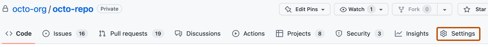

# Practice

This section contains step-by-step exercises. Each one is
**self-contained**: you can follow them in order or jump to whichever
interests you.

!!! tip "Before starting"
    Make sure you have Git installed and configured as we saw in
    [Workspace](../workspace.md), and the SSH connection with
    GitHub ready per [SSH Connection](../ssh.md).

## Exercise 1 · First commit

**Goal**: create a local repository, make a change, and confirm it.
**Estimated time**: 10 minutes.

### Step 1 · Create the folder

```bash
mkdir my-first-repo
cd my-first-repo
```

### Step 2 · Initialize Git

```bash
git init
```

You should see:

```text
Initialized empty Git repository in /path/to/my-first-repo/.git/
```

### Step 3 · Configure the default branch (optional)

If you haven't configured `init.defaultBranch=main` globally yet:

```bash
git checkout -b main
```

### Step 4 · Create a file

```bash
echo "# My first repo" > README.md
```

### Step 5 · Check the status

```bash
git status
```

You'll see:

```text
On branch main

No commits yet

Untracked files:
  (use "git add <file>..." to include in what will be committed)
        README.md

nothing added to commit but untracked files present (use "git add" to track)
```

### Step 6 · Add to staging

```bash
git add README.md
git status
```

```text
Changes to be committed:
  (use "git restore --staged <file>..." to unstage)
        new file:   README.md
```

### Step 7 · Make the first commit

```bash
git commit -m ":sparkles: Create initial README"
```

!!! success "Expected result"
    ```text
    [main (root-commit) abc1234] :sparkles: Create initial README
     1 file changed, 1 insertion(+)
     create mode 100644 README.md
    ```

### Step 8 · See the history

```bash
git log --oneline
```

You'll see your first commit with its short hash.

---

## Exercise 2 · Resolve a conflict

**Goal**: simulate a merge conflict and resolve it manually.
**Estimated time**: 15 minutes.

### Step 1 · Prepare the repository

```bash
mkdir conflict-demo && cd conflict-demo
git init && git checkout -b main
echo "Line 1" > greeting.txt
echo "Line 2" >> greeting.txt
git add greeting.txt
git commit -m ":sparkles: Initial version of greeting"
```

### Step 2 · Create a branch with a change

```bash
git switch -c feature/greeting
echo "Hello, world!" > greeting.txt
git commit -am ":sparkles: Greeting in English"
```

### Step 3 · Go back to main and make a different change

```bash
git switch main
echo "Hola, mundo!" > greeting.txt
git commit -am ":sparkles: Greeting in Spanish"
```

### Step 4 · Try the merge

```bash
git merge feature/greeting
```

Git can't decide which version of the file to keep:

```text
Auto-merging greeting.txt
CONFLICT (content): Merge conflict in greeting.txt
Automatic merge failed; fix conflicts and then commit the result.
```

### Step 5 · Inspect the conflict

```bash
cat greeting.txt
```

You'll see the markers:

```text
<<<<<<< HEAD
Hola, mundo!
=======
Hello, world!
>>>>>>> feature/greeting
```

### Step 6 · Resolve by hand

Edit the file and keep only the version you want:

```bash
echo "Hello, world!" > greeting.txt
```

(In real life, you probably want to keep both lines or choose
carefully.)

### Step 7 · Confirm the resolution

```bash
git add greeting.txt
git commit -m ":wrench: Resolve conflict in greeting.txt"
```

---

## Exercise 3 · Pull Request with code review

**Goal**: simulate a complete collaboration flow on GitHub: create a
branch, make a change, open a PR, receive feedback, apply it, and
merge. **Estimated time**: 30 minutes.

### Step 1 · Create the repository on GitHub

1. Go to [github.com/new](https://github.com/new).
2. Name: `practice-pr`.
3. Check *Add a README file*.
4. Click **Create repository**.

### Step 2 · Clone and create a branch

```bash
git clone git@github.com:YOUR_USER/practice-pr.git
cd practice-pr
git switch -c docs/add-installation
```

### Step 3 · Make a change

Edit `README.md` and add a section:

````md
## Installation

```bash
npm install my-package
```
````

(Use triple backticks in the actual file.)

### Step 4 · Commit and push

```bash
git add README.md
git commit -m ":books: Document installation in README"
git push -u origin docs/add-installation
```

### Step 5 · Open the PR

1. Go to the URL GitHub shows after the push.
2. Click **Compare & pull request**.
3. Title: `Document installation in README`.
4. Description: explanation of what you added and why.
5. **Mark as Draft**.
6. Click **Create pull request**.

### Step 6 · Receive feedback

Imagine a reviewer comments:

> "Missing prerequisites (Node.js >= 18)."

### Step 7 · Apply the feedback

Edit `README.md`:

````md
## Installation

**Prerequisite**: Node.js 18 or higher.

```bash
npm install my-package
```
````

Commit and push:

```bash
git add README.md
git commit -m ":wrench: Mention Node.js 18+ requirement"
git push
```

The PR updates automatically with the new commit.

### Step 8 · Approve and merge

1. Mark the PR as **Ready for review**.
2. Approve (yourself in this exercise).
3. **Squash and merge**.
4. Delete the branch.

---

## Exercise 4 · Configure branch protection

**Goal**: apply protection rules to the `main` branch from the
GitHub UI. **Estimated time**: 10 minutes.

!!! warning "Only applies to repositories where you're an admin"
    If it's your personal repo, perfect. If it's an organization's,
    ask for admin access first.

### Step 1 · Go to Settings → Branches

[github.com/YOUR_USER/practice-pr/settings/branches](https://github.com/YOUR_USER/practice-pr/settings/branches)

The first step is to navigate to the **Settings** tab of the
repository. In the screenshot below, the tab is highlighted in
orange at the right of the repo header:


> __Image:__ **Settings** tab in a GitHub repository header.

### Step 2 · Add a rule for `main`

1. Click **Add rule**.
2. **Branch name pattern**: `main`.
3. Enable:
   - ☑ Require a pull request before merging.
   - ☑ Require approvals: `1`.
   - ☑ Dismiss stale pull request approvals when new commits are pushed.
   - ☑ Require linear history (no merge commits).
   - ☑ Do not allow force pushes.
   - ☑ Do not allow deletions.
4. Click **Create**.

### Step 3 · Test that it works

```bash
git switch main
echo "Direct change" >> README.md
git commit -am "test"
git push
```

You should receive an error:

```text
remote: error: GH006: Protected branch update failed for refs/heads/main.
```

That confirms the protection works. To make changes to `main` now,
you have to do them via Pull Request.

---

## Additional resources

- [Git Official Tutorial](https://git-scm.com/docs/gittutorial).
- [Oh My Git!](https://ohmygit.org/) — game to learn Git visually.
- [Learn Git Branching](https://learngitbranching.js.org/?locale=en_US)
  — interactive tutorial with visualizations.
- [GitHub Skills](https://skills.github.com/) — short official
  courses.

## Next step

Go back to [Home](../index.md) to review all the material or explore
the [Glossary](../glosario.md).
