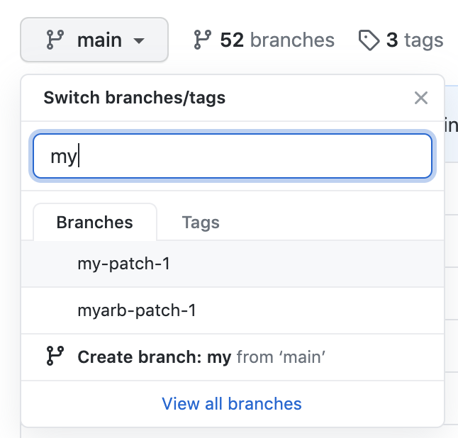
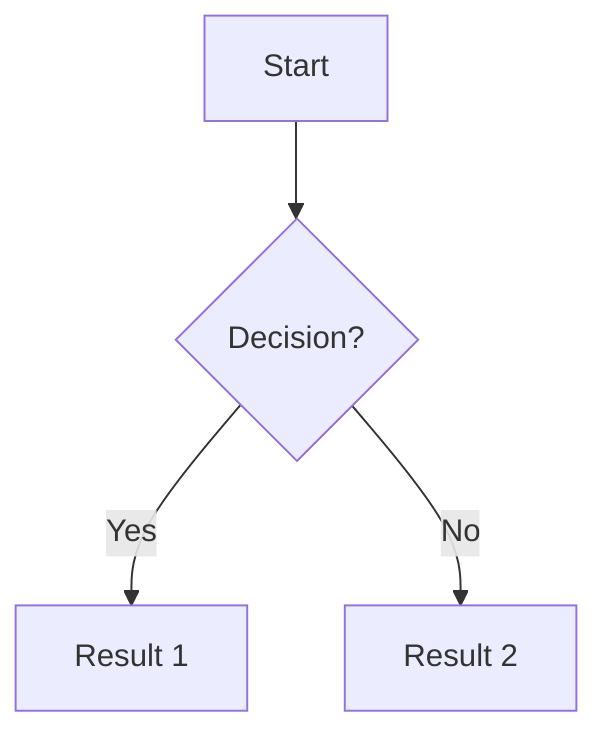

# Markdown syntax

Markdown is a [markup language][mdn] that formats plain text in a way
that's readable both in its raw and rendered form. It was created by
[John Gruber][gruber] in 2004 with the philosophy that **raw text
should be readable without processing**.

[mdn]: https://en.wikipedia.org/wiki/Markup_language
[gruber]: https://daringfireball.net/projects/markdown/

## 1. Why Markdown

Markdown is the standard format for:

- **Technical documentation**: GitHub, GitLab, Bitbucket, Gitea.
- **Forums and blogs**: Reddit, Discourse, Jekyll, Hugo, MkDocs.
- **Messaging**: Slack, Discord, Telegram, Microsoft Teams.
- **Notes**: Obsidian, Joplin, Notion (exports to Markdown).
- **E-learning**: Moodle, Canvas, Coursera.

Its main advantage is **portability**: a `.md` file looks the same
anywhere.

## 2. Headings

Markdown defines six heading levels with `#`:

```md
# Heading 1 (h1)
## Heading 2 (h2)
### Heading 3 (h3)
#### Heading 4 (h4)
##### Heading 5 (h5)
###### Heading 6 (h6)
```

!!! tip "Practical rules"
    - Each file should have **a single `h1`** (the title).
    - Don't skip levels: after `#`, use `##`, not `###`.
    - Leave a blank line before and after the heading.

## 3. Paragraphs and inline formatting

Paragraphs are separated by **a blank line**:

```md
This is the first paragraph.

This is the second paragraph.
```

Inline formatting:

| Syntax | Result |
|---|---|
| `**bold**` | **bold** |
| `_italic_` | _italic_ |
| `~~strikethrough~~` | ~~strikethrough~~ |
| `` `code` `` | `code` |
| `[text](url)` | [text](https://example.com) |

!!! tip "Underline"
    Markdown has no underline syntax because editors reserve it for
    links. If you need underline, use HTML:
    `<u>underlined text</u>`.

## 4. Lists

### Unordered lists

```md
- First item
- Second item
  - Sub-item
  - Another sub-item
- Third item
```

Result:

- First item
- Second item
  - Sub-item
  - Another sub-item
- Third item

You can use `-`, `*`, or `+` as the bullet; they are equivalent. We
recommend `-` for consistency.

### Ordered lists

```md
1. First step
2. Second step
3. Third step
```

Markdown numbers automatically. **You can use `1.` for all items**
and the renderer numbers them in order:

```md
1. First step
1. Second step
1. Third step
```

Result:

1. First step
1. Second step
1. Third step

### Task lists

```md
- [x] Configure Git
- [x] Create SSH key
- [ ] Install VS Code
- [ ] Make the first commit
```

Result:

- [x] Configure Git
- [x] Create SSH key
- [ ] Install VS Code
- [ ] Make the first commit

!!! tip "Task lists on GitHub"
    GitHub renders task lists as clickable checkboxes in Issues
    and PRs. Very useful for tracking a work plan.

## 5. Links and images

### Links

```md
[Visible text](https://example.com)
[With title](https://example.com "Title on hover")
[Reference][1]

[1]: https://example.com
```

For links to other pages on the same site:

```md
[Git Fundamentals](git/index.md)
[SSH Configuration](../ssh.md)
```

!!! note "Relative vs absolute paths"
    For internal links to your own repository, **always** use
    relative paths (`../ssh.md`, `tools/ide.md`). That way the
    links work both on GitHub and on the site rendered by MkDocs.

### Images

```md


```

Identical syntax to a link, but with `!` in front. The
**alternative text** is mandatory (accessibility + fallback if the
image fails to load).

!!! tip "Image size"
    Markdown doesn't allow controlling size. If you need to
    resize, use HTML:

    ```md
    
    ```

## 6. Code

### Inline code

To mention code inside a paragraph:

```md
Use the `git status` command to see the repository state.
```

### Code blocks

Three backticks (\`\`\`) delimit a block, optionally with the
language for highlighting:

````md
```python
def greet(name):
    print(f"Hello, {name}!")
```
````

Renders with highlighting according to Pygments lexer:

```python
def greet(name):
    print(f"Hello, {name}!")
```

!!! tip "Nested blocks"
    To show a code block inside another (e.g., documenting
    Markdown in Markdown), use **four** backticks for the outer
    block and three for the inner one.

### Titled blocks

With the Material extension (configured on this site), you can
add a title to the block:

````md
```bash title="Installing Git on Ubuntu"
sudo apt update
sudo apt install git
```
````

## 7. Tables

Standard Markdown (CommonMark + GFM) supports tables:

```md
| Column A | Column B | Column C |
| -------- | -------- | -------- |
| A1       | B1       | C1       |
| A2       | B2       | C2       |
| A3       | B3       | C3       |
```

Renders as:

| Column A | Column B | Column C |
| -------- | -------- | -------- |
| A1       | B1       | C1       |
| A2       | B2       | C2       |
| A3       | B3       | C3       |

### Alignment

Modify the separators in the second row:

```md
| Left     | Center   | Right    |
| :------- | :------: | -------: |
| A        |    B     |        C |
```

Renders as:

| Left     | Center   | Right    |
| :------- | :------: | -------: |
| A        |    B     |        C |

## 8. Admonitions (Material)

Admonitions are highlighted blocks for notes, tips, and warnings.
**It's a Material extension for MkDocs**, not standard Markdown.

```md
!!! note "Optional title"
    Note content.
```

Available types:

| Type | Use | Example |
|---|---|---|
| `note` | Additional information | !!! note |
| `tip` | Practical advice | !!! tip |
| `info` | Neutral information | !!! info |
| `warning` | Warning | !!! warning |
| `danger` | Error or destructive action | !!! danger |
| `example` | Example | !!! example |
| `question` | Frequent question | !!! question |

Example:

!!! tip "Featured tip"
    This is an example of a rendered admonition.

!!! warning "Important warning"
    If you see this in red, pay attention.

## 9. Tabs (Material)

For alternative content (multi-platform, different versions):

```md
=== "Windows"

    Command for Windows.

=== "macOS"

    Command for macOS.

=== "Linux"

    Command for Linux.
```

Renders as clickable tabs.

!!! tip "Synchronized tabs"
    With `!!! tip "Common configuration" { #common }` you can link
    tabs that live in different pages. More info in the
    [official Material documentation](https://squidfunk.github.io/mkdocs-material/reference/content-tabs/#content-tabs).

## 10. Diagrams with Mermaid

[Mermaid](https://mermaid.js.org/) lets you draw diagrams with
text. The site supports it natively:

````md

````

Renders as:


Supported diagram types:

- **flowchart** (`graph TD/LR`).
- **sequenceDiagram** (interactions between actors).
- **classDiagram**, **stateDiagram**, **erDiagram**.
- **gantt**, **pie**, **gitGraph**, etc.

!!! tip "Live editor"
    Try diagrams in the [Mermaid Live Editor](https://mermaid.live/)
    before pasting them into the `.md`.

## 11. Embedded HTML

Since Markdown is a superset of HTML, you can use inline HTML tags
when Markdown isn't enough:

```md
Text in <sub>subscript</sub> or in <sup>superscript</sup>.

<details>
    <summary>Click to expand</summary>
    Hidden content.
</details>
```

!!! warning "Use HTML only when necessary"
    Embedded HTML breaks portability: not all renderers support
    it. For 95% of cases, there's an alternative in Markdown or in
    Material extensions.

## 12. Comments

To leave notes that don't render:

```md
<!-- This is a comment and won't appear in the render -->
```

Useful for hidden TODOs or to temporarily disable sections:

```md
<!--
!!! warning "Work in progress"
    This section is under development.
-->
```

## 13. Quick reference

| I want to... | Syntax |
|---|---|
| Section title | `# Title` |
| Bold | `**text**` |
| Italic | `_text_` |
| Inline code | `` `code` `` |
| Link | `[text](url)` |
| Image | `` |
| Bulleted list | `- item` |
| Numbered list | `1. item` |
| Checkbox | `- [ ] item` |
| Table | `\| col \| col \|` |
| Code block | ` ```language ` |
| Quote | `> text` |
| Horizontal rule | `---` |

## Next step

With the syntax mastered, you can move on to
[Practice](../practice/index.md) to apply everything in real
exercises, or go back to [VS Code IDE](ide.md) to configure your
editor.
