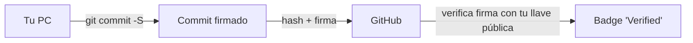

# Confirmación de cambios firmados en Git

Cualquiera puede configurar un nombre y correo en Git y hacer un
commit que aparente ser de otra persona. Esto es un riesgo cuando
importa la **trazabilidad de la identidad**, especialmente en:

- Proyectos de código abierto con muchos colaboradores.
- Repositorios donde las contribuciones cuentan para una
  certificación legal o compliance.
- Equipos que necesitan probar quién introdujo un cambio.

Git resuelve esto con **firmas criptográficas**: cada commit puede
venir con una prueba matemática de que fue generado por la persona
que dice ser. GitHub (y GitLab) validan esa firma y muestran el
badge **"Verified"** al lado del commit.



## 1. Elegir una herramienta de firma

Hay dos formas modernas de firmar commits:

| Herramienta | Algoritmo | Soporte | Notas |
|---|---|---|---|
| **GnuPG (GPG)** | RSA, Ed25519, ECC | GitHub, GitLab, Bitbucket, Gitea | Estándar clásico. Requiere instalar GPG. |
| **SSH signing** | Ed25519, RSA | GitHub (desde 2022), GitLab | Reusa tu llave SSH existente. Más simple. |

En esta guía usamos **GPG** porque es el método más universal. Si ya
tenés SSH configurado, podés ver la [guía oficial de GitHub sobre
SSH signing](https://docs.github.com/en/authentication/managing-commit-signature-verification/about-commit-signature-verification#ssh-commit-signature-verification)
como alternativa.

## 2. Instalar GnuPG

=== "Windows"

    1. Descargá [Gpg4Win](https://gpg4win.org/download.html).
    2. En el instalador, **solo tildá "GnuPG"** (las demás
       herramientas son opcionales y suman ruido al menú).
    3. Después de instalar, abrí **Git Bash** y verificá:

       ```bash
       gpg --version
       ```

=== "macOS"

    Con Homebrew:

    ```bash
    brew install gnupg
    ```

    Verificá:

    ```bash
    gpg --version
    ```

=== "Linux"

    Debian/Ubuntu:

    ```bash
    sudo apt install gpg
    ```

    Fedora:

    ```bash
    sudo dnf install gnupg
    ```

    Verificá:

    ```bash
    gpg --version
    ```

## 3. Generar la llave GPG

Generá una llave nueva con el algoritmo **Ed25519** (recomendado) o
**RSA 4096** (compatibilidad amplia):

=== "Ed25519"

    ```bash
    gpg --quick-generate-key "Tu Nombre <tu.correo@ejemplo.com>" ed25519 default 0
    ```

    El `0` final significa que la llave **no expira**. Si querés que
    expire, reemplazalo por una duración como `1y` (un año) o `2y`.

=== "RSA 4096"

    ```bash
    gpg --full-generate-key
    ```

    El asistente te pregunta:

    1. Tipo: `(1) RSA and RSA` (Enter).
    2. Tamaño: `4096`.
    3. Expiración: `0` (nunca expira) o tu preferencia.
    4. Confirmá con `O` (OK).
    5. Nombre y apellido.
    6. Correo (el mismo que en GitHub).
    7. Comentario opcional.
    8. Passphrase (recomendado).

Después de unos segundos, GPG te confirma con un mensaje similar a:

```text
gpg: key 5F2A8B3C9D4E1F6A marked as ultimately trusted
gpg: revocation certificate stored as '/home/usuario/.gnupg/openpgp-revocs.d/5F2A8B3C9D4E1F6A.rev'
```

!!! warning "Guardá el certificado de revocación"
    El archivo `.rev` sirve para **revocar** la llave si se ve
    comprometida. Guardalo en un lugar seguro (no en el mismo
    equipo).

## 4. Obtener el ID de la llave

Para que Git y GitHub identifiquen tu llave, necesitás el **ID largo**:

```bash
gpg --list-secret-keys --keyid-format LONG
```

Vas a ver algo como:

```text
sec   ed25519/5F2A8B3C9D4E1F6A 2026-01-15 [SC]
      1234567890ABCDEF1234567890ABCDEF12345678
uid                   [ultimate] Tu Nombre <tu.correo@ejemplo.com>
ssb   ed25519/A1B2C3D4E5F6G7H8 2026-01-15 [E]
```

El ID que necesitás es el que aparece después de `ed25519/` en la
línea `sec`: en este caso, **`5F2A8B3C9D4E1F6A`**.

## 5. Exportar la llave pública en formato ASCII

Para subirla a GitHub:

```bash
gpg --armor --export 5F2A8B3C9D4E1F6A
```

Copiá **todo** el output, incluyendo las líneas:

```text
-----BEGIN PGP PUBLIC KEY BLOCK-----
...
-----END PGP PUBLIC KEY BLOCK-----
```

!!! info "El comando `armor`"
    Sin `--armor`, GPG exporta la llave en binario. GitHub necesita
    el formato ASCII (base64) para pegarlo en un formulario web.

## 6. Subir la llave a GitHub

1. Andá a [github.com/settings/gpg/new](https://github.com/settings/gpg/new).
2. **Title**: un nombre descriptivo (ej. "GPG MacBook personal").
3. **Key**: pegá el bloque que copiaste.
4. Clic en **Add GPG key**.

Si el correo de la llave coincide con un correo verificado de tu
cuenta de GitHub, los commits firmados con esa llave van a
mostrarse como **Verified**.

!!! tip "Múltiples correos"
    Si usás varios correos (trabajo + personal), agregá cada uno a
    la llave al momento de generarla, o generá llaves separadas y
    subí cada una. Para que un commit firmado se muestre como
    verificado, el `user.email` de Git tiene que coincidir con un
    correo de la llave Y estar verificado en GitHub.

## 7. Configurar Git para usar la llave

Indicá a Git qué llave usar para firmar:

```bash
git config --global user.signingkey 5F2A8B3C9D4E1F6A
git config --global commit.gpgsign true    # firmar TODOS los commits
git config --global tag.gpgsign true       # firmar los tags también
```

Con `commit.gpgsign true`, no necesitás acordarte de tipear `-S` en
cada commit; Git firma automáticamente.

!!! note "Si `gpg` no está en tu PATH"
    En Windows con Git Bash, GPG se instala en
    `C:\Program Files (x86)\GnuPG\bin\gpg.exe`. Si Git no lo
    encuentra, configurá la ruta manualmente:

    ```bash
    git config --global gpg.program "C:/Program Files (x86)/GnuPG/bin/gpg.exe"
    ```

## 8. Hacer commits firmados

Si activaste `commit.gpgsign true`, todos tus commits quedan
firmados automáticamente. Si lo desactivaste:

```bash
git commit -S -m "Confirmación firmada con GPG"
```

Para merges:

```bash
git merge --verify-signatures -S feature/login
```

`--verify-signatures` rechaza el merge si alguno de los commits
entrantes no está firmado. Útil cuando el repositorio exige
firma obligatoria (lo verás en las *branch protection rules*).

## 9. Verificar firmas localmente

Para inspeccionar la firma de un commit:

```bash
git log --show-signature -1
```

Vas a ver:

```text
commit 8a4f9c2b3e1d7a6f...
gpg: Signature made [date]
gpg:                using EDDSA key 5F2A8B3C9D4E1F6A
gpg: Good signature from "Tu Nombre <tu.correo@ejemplo.com>"
```

Si la firma es inválida, GPG muestra `BAD signature`. En ese caso,
**no confíes en el commit**: podría haber sido manipulado.

## 10. Rotar una llave comprometida

Si tu llave privada se ve expuesta (laptop robada, backup
filtrado), revocá la llave inmediatamente:

1. Importá el certificado de revocación:

   ```bash
   gpg --import /ruta/al/certificado.rev
   ```

2. Publicá la revocación en un servidor de llaves público:

   ```bash
   gpg --keyserver hkps://keys.openpgp.org --send-keys 5F2A8B3C9D4E1F6A
   ```

3. Quitá la llave de GitHub
   ([Settings → SSH and GPG keys](https://github.com/settings/keys)).

4. Generá una llave nueva y repetí el proceso de upload.

!!! tip "Caducidad preventiva"
    Una alternativa al certificado de revocación es generar llaves
    con expiración (ej. 1 año) y renovarlas antes de que expiren.
    Es disciplina, pero reduce la ventana de exposición.

## 11. Almacenar credenciales GPG (caché de passphrase)

Cada vez que firmás un commit, GPG te pide la **passphrase** para
desbloquear la llave privada. Si tuvieras que tipearla en cada commit,
el flujo se vuelve tedioso. La solución es `gpg-agent`, un proceso en
segundo plano (análogo a `ssh-agent`) que **cachea la passphrase
desbloqueada** por un tiempo configurable.

### Configurar el TTL del caché

El TTL por defecto suele ser **10 horas** (3600 segundos × 10) tras
la última vez que usaste la llave. Para modificarlo, editá
`~/.gnupg/gpg-agent.conf`:

```ini
default-cache-ttl 3600        # 1 hora desde el último uso
max-cache-ttl 86400           # tope absoluto de 24 horas
```

Después de editar, recargá el agente:

```bash
gpgconf --reload gpg-agent
```

### Pinentry: la ventana que pide la passphrase

`gpg-agent` delega la captura de la passphrase a un programa llamado
**pinentry**. El comportamiento cambia según el sistema:

=== "Linux / WSL"

    Por defecto usa `pinentry-tty` (lee la passphrase desde la
    terminal). Si preferís una GUI, instalá `pinentry-gnome3` (GNOME)
    o `pinentry-qt` (KDE) y elegilo en `gpg-agent.conf`:

    ```ini
    pinentry-program /usr/bin/pinentry-gnome3
    ```

=== "macOS"

    [GPG Suite](https://gpgtools.org/) instala `pinentry-mac`, una
    ventanita nativa con la opción **"Save in Keychain"** para no
    volver a pedir la passphrase hasta el TTL configurado.

=== "Windows"

    Gpg4win trae `pinentry-qt` o `pinentry-w32` (elegible desde
    `gpg-agent.conf`). La passphrase queda cacheada por `gpg-agent`
    hasta el TTL configurado.

!!! warning "GPG-agent no es lo mismo que Git Credential Manager"
    `gpg-agent` cachea la **passphrase de tu llave GPG** para firmar
    commits. **No** cachea credenciales HTTPS. Para autenticarte vía
    HTTPS usá [Git Credential
    Manager](https://github.com/git-ecosystem/git-credential-manager)
    (GCM), que cubre usuario y token pero **no firma commits**. Son
    dos sistemas independientes.

!!! note "Si VS Code no encuentra `gpg`"
    En Windows con Git Bash, GPG se instala en
    `C:\Program Files (x86)\GnuPG\bin\gpg.exe`. Si al firmar un
    commit desde VS Code ves `gpg: failed to start...`, declarale la
    ruta manualmente:

    ```bash
    git config --global gpg.program "C:/Program Files (x86)/GnuPG/bin/gpg.exe"
    ```

## Próximo paso

Con la firma criptográfica cubierta, podés volver a
[Fundamentos de Git y GitHub](index.md) para repasar el flujo de
Pull Requests, o saltar a la sección de
[Práctica](../practice/index.md) para hacer ejercicios completos.
