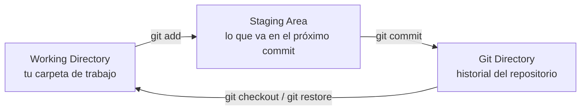
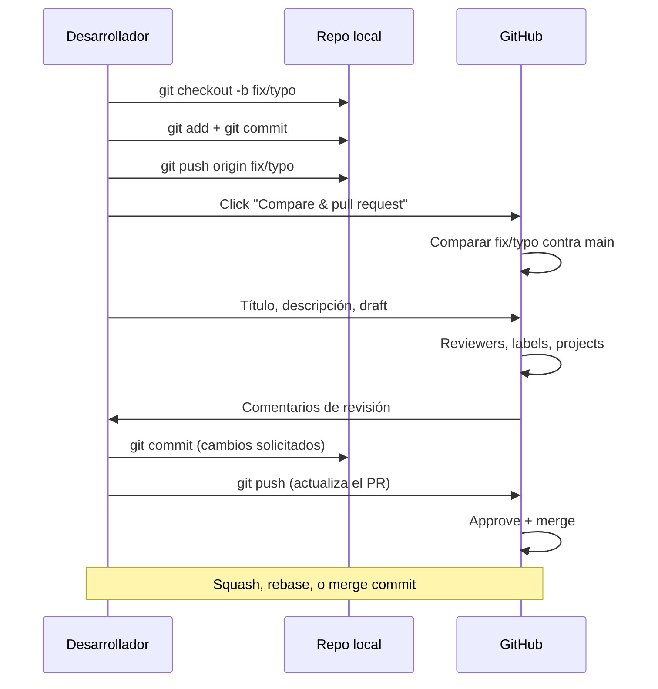

# Fundamentos de Git y GitHub

Git es un **sistema de control de versiones distribuido** que registra
los cambios de un conjunto de archivos a lo largo del tiempo. A
diferencia de los sistemas centralizados, cada clon de un repositorio
Git es un repositorio completo con todo el historial, lo que te permite
trabajar offline y tener redundancia natural.

!!! note "No es GitHub"
    **Git** es el software de control de versiones. **GitHub**, GitLab
    y Bitbucket son plataformas que hospedan repositorios Git y suman
    herramientas colaborativas (Pull Requests, issues, Actions).
    Podés usar Git sin GitHub, y podés tener repositorios en GitHub
    que no usen Git (no es habitual, pero posible).

## 1. Los tres estados de Git

Git maneja tres áreas donde viven los archivos:



| Estado | Qué representa | Cómo se ve |
|---|---|---|
| **Working Directory** | La copia de trabajo. Archivos tal como están en tu disco. | `git status` muestra archivos *modified* o *untracked*. |
| **Staging Area** (también llamado *index*) | Lo que va a incluirse en el próximo commit. | `git status` muestra *Changes to be committed*. |
| **Git Directory** (`.git/`) | El historial versionado. Solo Git lo toca. | Lo que ves con `git log`. |

!!! tip "La staging area es opcional pero poderosa"
    Te permite ir preparando un commit lógico a lo largo de varias
    ediciones, agregando archivos al staging a medida que estén
    listos, y haciendo un único commit cuando todo esté coherente.

### Comandos esenciales

```bash
# Ver el estado actual
git status

# Pasar archivos del WD al staging
git add archivo.txt
git add docs/           # una carpeta
git add -A              # todos los archivos modificados/nuevos

# Confirmar los cambios staged
git commit -m "Mensaje descriptivo del cambio"

# Sacar un archivo del staging (sin perder los cambios)
git restore --staged archivo.txt

# Descartar cambios en el WD (¡cuidado, es destructivo!)
git restore archivo.txt

# Ver el historial
git log
git log --oneline
git log --graph --oneline --all
```

## 2. Inicializar un repositorio

Para empezar a versionar una carpeta:

```bash
cd mi-proyecto
git init
```

Git crea un subdirectorio oculto `.git/` con toda la metadata del
repositorio. A partir de ese momento, esa carpeta es un repositorio
Git.

!!! tip "Clonar vs init"
    - `git init` convierte una carpeta existente en un repositorio.
    - `git clone <url>` descarga una copia de un repositorio remoto.

## 3. Confirmar cambios (`commit`)

Un commit es una **instantánea** del estado del staging area en un
momento dado, identificada por un hash SHA-1 único.

```bash
git commit -m "Agregar función de búsqueda"
```

!!! tip "Mensajes de commit"
    - Usá imperativo: "Agregar", "Corregir", "Eliminar", no "Agregué"
      ni "Se agregó".
    - Primera línea de 50 caracteres o menos.
    - Línea en blanco y descripción más larga si hace falta.
    - Más detalles en la [skill `commit-conventional`][commit-skill]
      del repositorio (convención con gitmoji).

[commit-skill]: https://github.com/novocap/git-documentation/blob/master/.opencode/skills/commit-conventional/SKILL.md

Para revisar lo que va a incluirse antes de commitear:

```bash
git diff                # cambios en el WD que no están en staging
git diff --staged       # cambios en staging vs último commit
git diff HEAD           # cambios en WD vs último commit (incluye staged)
```

## 4. Ramas (`branch`)

Las ramas son punteros a commits que te permiten trabajar en líneas
de desarrollo paralelas. La rama por defecto suele llamarse `main`
(o `master` en proyectos más viejos).

```bash
# Ver todas las ramas locales
git branch

# Crear una rama nueva
git branch feature/login

# Movernos a una rama
git switch feature/login

# Crear y moverse en un paso
git switch -c feature/login

# Listar ramas locales y remotas
git branch -a
```

!!! note "`switch` y `restore` vs el viejo `checkout`"
    A partir de Git 2.23 (2019) se introdujeron `switch` y `restore`
    para separar las dos funciones que tenía `checkout`:
    - `git switch X` cambia de rama.
    - `git restore archivo` descarta cambios del archivo.
    - `git checkout` sigue funcionando por compatibilidad, pero los
      comandos nuevos son más explícitos.

### Merge: unir dos ramas

Cuando el trabajo de una rama está listo, lo unimos con `merge`:

```bash
git switch main
git merge feature/login
```

Tipos de merge:

- **Fast-forward**: si `main` no avanzó, simplemente mueve el
  puntero. No se crea un commit de merge.
- **Three-way**: si ambas ramas tienen commits propios, Git crea
  un commit de merge que tiene dos padres.

!!! warning "Conflictos"
    Si Git no puede decidir qué cambios conservar, marca el archivo
    con marcadores `<<<<<<<`, `=======` y `>>>>>>>`. Editá el archivo
    a mano, `git add` para marcarlo como resuelto, y completá el
    merge con `git commit`.

## 5. Trabajo con repositorios remotos

Los comandos para interactuar con un repositorio en GitHub/GitLab:

```bash
# Ver los remotos configurados
git remote -v

# Agregar un remoto
git remote add origin git@github.com:usuario/repo.git

# Descargar cambios sin mezclarlos
git fetch origin

# Descargar y mezclar
git pull origin main

# Subir tu rama al remoto
git push origin feature/login

# Subir la rama y vincularla al upstream en un solo paso
git push -u origin feature/login
```

!!! tip "`fetch` + `merge` vs `pull`"
    `git pull` es esencialmente `git fetch` seguido de `git merge`.
    Cuando vas a trabajar en equipo es preferible hacer `fetch`
    explícito y revisar antes de mezclar.

## 6. Pull Requests en GitHub

Un **Pull Request** (PR) es una propuesta de cambios que GitHub
presenta de forma visual, junto con herramientas de revisión.

Después de hacer `git push` de una rama, GitHub muestra un banner
amarillo arriba de la lista de archivos con el botón **"Compare &
pull request"**:


> __Imagen:__ Banner de GitHub para crear un PR desde una rama recién
> pusheada.



### Anatomía de un PR

| Campo | Qué poner |
|---|---|
| **Título** | Descripción corta del cambio en imperativo. |
| **Descripción** | Contexto, motivación, cómo probar, capturas. |
| **Reviewers** | Quiénes deben revisar. |
| **Assignees** | Quiénes son responsables de cerrarlo. |
| **Labels** | Tags para clasificar (`bug`, `docs`, `enhancement`). |
| **Projects** | A qué proyecto (Kanban) pertenece. |
| **Milestone** | Release/entrega objetivo. |
| **Draft** | Marcar como borrador mientras no esté listo. |

!!! tip "Draft PRs"
    Un PR en **Draft** se ve en la lista pero **no se puede
    mergear** y notifica a los reviewers de forma diferente.
    Usalo cuando todavía estás trabajando y querés que se vean los
    commits (para CI, por ejemplo).

## 7. Comandos avanzados útiles

### `git stash`: guardar cambios sin commitear

```bash
git stash                  # guarda WD + staging en una pila
git stash pop               # recupera lo último guardado
git stash list              # lista los stashes
git stash drop stash@{0}    # elimina un stash específico
```

Útil cuando tenés cambios a medio hacer y necesitás cambiar de rama
rápido.

### `git tag`: marcar puntos importantes

```bash
git tag v1.0.0                  # tag ligero en el HEAD actual
git tag -a v1.0.0 -m "Release" # tag anotado con mensaje
git push origin v1.0.0          # publicar el tag
```

!!! tip "Tags vs branches"
    Una rama sigue recibiendo commits; un tag es una marca
    inmutable. Para releases de software se usan tags.

### `git log`: filtrar el historial

```bash
# Commits del autor actual
git log --author="$(git config user.name)"

# Commits que cambiaron un archivo específico
git log --follow -- ruta/al/archivo.md

# Commits entre dos puntos
git log main..feature/login

# Una línea por commit con formato custom
git log --pretty=format:"%h %ad | %s%d [%an]" --graph --date=short
```

### `git reflog`: la red de seguridad

`git reflog` muestra **todos** los movimientos de `HEAD`, incluso
los que borraste o abandonaste. Es la herramienta para recuperar
"casi todo" en Git.

```bash
git reflog
git reset --hard HEAD@{5}  # volver al estado de hace 5 movimientos
```

!!! warning "`reflog` es local"
    El reflog existe solo en tu clon. No se sube al remoto ni lo ven
    otros colaboradores. Sirve para recuperar errores propios.

## 8. Buenas prácticas

1. **Commits chicos y enfocados**: un commit = una idea.
2. **Mensajes en imperativo**: "Corregir typo en README", no
   "Corregí typo en README".
3. **Ramas por feature**: cada cambio nuevo en su propia rama.
4. **Pull antes de push**: siempre actualizar antes de subir.
5. **No commitear secretos**: usá `.gitignore` para `.env`,
   credenciales, llaves privadas.
6. **Revisá antes de `git add -A`**: revisá qué estás agregando.
7. **Usá `--force-with-lease` en lugar de `--force`**: si el remoto
   avanzó, no pisás esos commits sin darte cuenta.

## Próximo paso

Con los fundamentos cubiertos, podés pasar a
[Confirmación de cambios firmados en Git](gpg.md) para aprender a
firmar tus commits criptográficamente y validar tu identidad en
GitHub.
