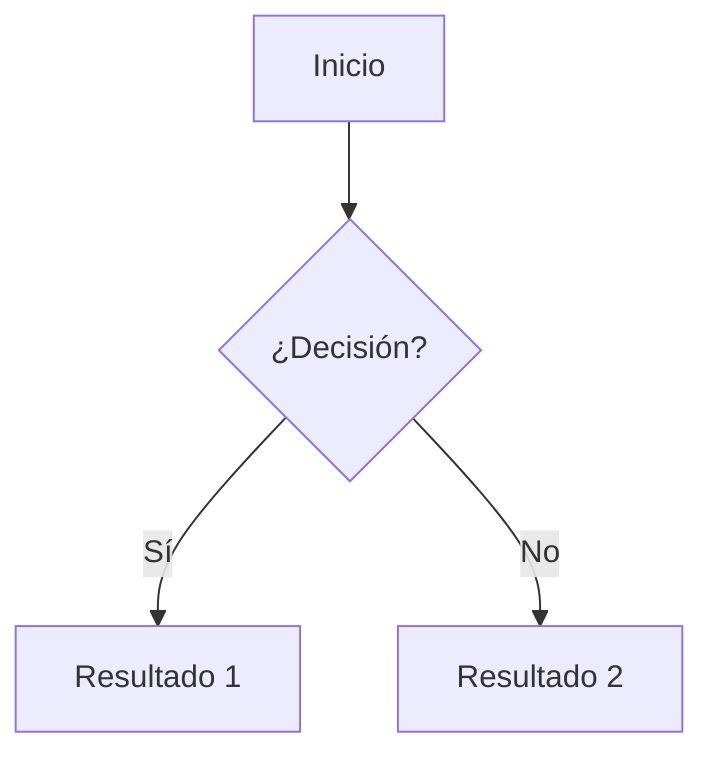

# Sintaxis documental con Markdown

Markdown es un [lenguaje de marcado][mdn] que da formato a texto
plano de manera legible tanto en su forma cruda como renderizada.
Fue creado por [John Gruber][gruber] en 2004 con la filosofía de que
**el texto crudo debe ser legible sin procesamiento**.

[mdn]: https://es.wikipedia.org/wiki/Lenguaje_de_marcado
[gruber]: https://daringfireball.net/projects/markdown/

## 1. Por qué Markdown

Markdown es el formato estándar para:

- **Documentación técnica**: GitHub, GitLab, Bitbucket, Gitea.
- **Foros y blogs**: Reddit, Discourse, Jekyll, Hugo, MkDocs.
- **Mensajería**: Slack, Discord, Telegram, Microsoft Teams.
- **Notas**: Obsidian, Joplin, Notion (exporta a Markdown).
- **E-learning**: Moodle, Canvas, Coursera.

Su ventaja principal es la **portabilidad**: un archivo `.md` se ve
igual en cualquier lado.

## 2. Encabezados

Markdown define seis niveles de encabezado con `#`:

```md
# Encabezado 1 (h1)
## Encabezado 2 (h2)
### Encabezado 3 (h3)
#### Encabezado 4 (h4)
##### Encabezado 5 (h5)
###### Encabezado 6 (h6)
```

!!! tip "Reglas prácticas"
    - Cada archivo debe tener **un solo `h1`** (el título).
    - No salteés niveles: después de `#`, vení con `##`, no con
      `###`.
    - Dejá una línea en blanco antes y después del encabezado.

## 3. Párrafos y formato de texto

Los párrafos se separan con **una línea en blanco**:

```md
Este es el primer párrafo.

Este es el segundo párrafo.
```

Formato inline:

| Sintaxis | Resultado |
|---|---|
| `**negrita**` | **negrita** |
| `_cursiva_` | _cursiva_ |
| `~~tachado~~` | ~~tachado~~ |
| `` `código` `` | `código` |
| `[texto](url)` | [texto](url) |

!!! tip "Subrayado"
    Markdown no tiene sintaxis para subrayado porque los editores lo
    reservan para los links. Si necesitás subrayado, usá HTML:
    `<u>texto subrayado</u>`.

## 4. Listas

### Listas no ordenadas

```md
- Primer ítem
- Segundo ítem
  - Sub-ítem
  - Otro sub-ítem
- Tercer ítem
```

Resultado:

- Primer ítem
- Segundo ítem
  - Sub-ítem
  - Otro sub-ítem
- Tercer ítem

Podés usar `-`, `*` o `+` como viñeta; son equivalentes. Te
recomendamos `-` por consistencia.

### Listas ordenadas

```md
1. Primer paso
2. Segundo paso
3. Tercer paso
```

Markdown numera automáticamente. **Podés usar `1.` para todos los
ítems** y el renderizador los numera en orden:

```md
1. Primer paso
1. Segundo paso
1. Tercer paso
```

Resultado:

1. Primer paso
1. Segundo paso
1. Tercer paso

### Listas de tareas

```md
- [x] Configurar Git
- [x] Crear llave SSH
- [ ] Instalar VS Code
- [ ] Hacer el primer commit
```

Resultado:

- [x] Configurar Git
- [x] Crear llave SSH
- [ ] Instalar VS Code
- [ ] Hacer el primer commit

!!! tip "Listas de tareas en GitHub"
    GitHub renderiza las listas de tareas como checkboxes clickeables
    en Issues y PRs. Es muy útil para hacer seguimiento de un plan
    de trabajo.

## 5. Enlaces e imágenes

### Enlaces

```md
[Texto visible](https://ejemplo.com)
[Con título](https://ejemplo.com "Título al hacer hover")
[Referencia][1]

[1]: https://ejemplo.com
```

Para enlaces a otras páginas del mismo sitio:

```md
[Fundamentos de Git](git/index.md)
[Configuración de SSH](../ssh.md)
```

!!! note "Rutas relativas vs absolutas"
    Para links internos a tu propio repositorio, **siempre** usá
    rutas relativas (`../ssh.md`, `tools/ide.md`). Así los links
    funcionan tanto en GitHub como en el sitio renderizado por
    MkDocs.

### Imágenes

```md


```

Sintaxis idéntica a un enlace, pero con `!` adelante. El **texto
alternativo** es obligatorio (accesibilidad + fallback si la imagen
no carga).

!!! tip "Tamaño de imágenes"
    Markdown no permite controlar el tamaño. Si necesitás
    redimensionar, usá HTML:

    ```md
    
    ```

## 6. Código

### Código inline

Para mencionar código dentro de un párrafo:

```md
Usá el comando `git status` para ver el estado del repositorio.
```

### Bloques de código

Tres backticks (\`\`\`) delimitan un bloque, opcionalmente con el
lenguaje para highlighting:

````md
```python
def saludar(nombre):
    print(f"Hola, {nombre}!")
```
````

Renderiza con highlighting según el lexer de Pygments:

```python
def saludar(nombre):
    print(f"Hola, {nombre}!")
```

!!! tip "Bloques anidados"
    Para mostrar un bloque de código dentro de otro (por ejemplo,
    documentar Markdown en Markdown), usá **cuatro** backticks para
    el bloque externo y tres para el interno.

### Bloques con título

Con la extensión Material (configurada en este sitio), podés poner
título al bloque:

````md
```bash title="Instalación de Git en Ubuntu"
sudo apt update
sudo apt install git
```
````

## 7. Tablas

Markdown estándar (CommonMark + GFM) soporta tablas:

```md
| Columna A | Columna B | Columna C |
| --------- | --------- | --------- |
| A1        | B1        | C1        |
| A2        | B2        | C2        |
| A3        | B3        | C3        |
```

Renderiza como:

| Columna A | Columna B | Columna C |
| --------- | --------- | --------- |
| A1        | B1        | C1        |
| A2        | B2        | C2        |
| A3        | B3        | C3        |

### Alineación

Modificá los separadores de la segunda fila:

```md
| Izquierda | Centro | Derecha |
| :-------- | :----: | ------: |
| A         |   B    |       C |
```

Renderiza como:

| Izquierda | Centro | Derecha |
| :-------- | :----: | ------: |
| A         |   B    |       C |

## 8. Admonitions (Material)

Las admonitions son bloques destacados para notas, tips y warnings.
**Es una extensión de Material para MkDocs**, no Markdown estándar.

```md
!!! note "Título opcional"
    Contenido de la nota.
```

Tipos disponibles:

| Tipo | Uso | Ejemplo |
|---|---|---|
| `note` | Información adicional | !!! note |
| `tip` | Consejo práctico | !!! tip |
| `info` | Información neutral | !!! info |
| `warning` | Advertencia | !!! warning |
| `danger` | Error o acción destructiva | !!! danger |
| `example` | Ejemplo | !!! example |
| `question` | Pregunta frecuente | !!! question |

Ejemplo:

!!! tip "Tip destacado"
    Este es un ejemplo de admonition renderizada.

!!! warning "Advertencia importante"
    Si ves esto en rojo, prestá atención.

## 9. Tabs (Material)

Para contenido alternativo (multiplataforma, diferentes versiones):

```md
=== "Windows"

    Comando para Windows.

=== "macOS"

    Comando para macOS.

=== "Linux"

    Comando para Linux.
```

Renderiza como tabs clicables.

!!! tip "Tabs sincronizados"
    Con `!!! tip "Configuración común" { #common }` podés vincular
    tabs que viven en distintas páginas. Más info en la
    [documentación oficial de Material](https://squidfunk.github.io/mkdocs-material/reference/content-tabs/#content-tabs).

## 10. Diagramas con Mermaid

[Mermaid](https://mermaid.js.org/) permite dibujar diagramas con
texto. El sitio lo soporta nativamente:

````md

````

Renderiza como:


Tipos de diagramas soportados:

- **flowchart** (`graph TD/LR`).
- **sequenceDiagram** (interacciones entre actores).
- **classDiagram**, **stateDiagram**, **erDiagram**.
- **gantt**, **pie**, **gitGraph**, etc.

!!! tip "Live editor"
    Probá diagramas en el [Mermaid Live Editor](https://mermaid.live/)
    antes de pegarlos en el `.md`.

## 11. HTML embebido

Como Markdown es un superconjunto de HTML, podés usar etiquetas HTML
inline cuando Markdown no alcanza:

```md
Texto en <sub>subíndice</sub> o en <sup>superíndice</sup>.

<details>
    <summary>Click para desplegar</summary>
    Contenido oculto.
</details>
```

!!! warning "Usá HTML solo cuando sea necesario"
    El HTML embebido rompe la portabilidad: no todos los
    renderizadores lo soportan. Para el 95% de los casos, hay una
    alternativa en Markdown o en extensiones Material.

## 12. Comentarios

Para dejar notas que no se rendericen:

```md
<!-- Esto es un comentario y no aparece en el render -->
```

Útil para TODO ocultos o para desactivar temporalmente secciones:

```md
<!--
!!! warning "Work in progress"
    Esta sección está en desarrollo.
-->
```

## 13. Referencia rápida

| Quiero... | Sintaxis |
|---|---|
| Título de sección | `# Título` |
| Negrita | `**texto**` |
| Cursiva | `_texto_` |
| Código inline | `` `código` `` |
| Link | `[texto](url)` |
| Imagen | `` |
| Lista con viñetas | `- item` |
| Lista numerada | `1. item` |
| Checkbox | `- [ ] item` |
| Tabla | `\| col \| col \|` |
| Bloque de código | ` ```lenguaje ` |
| Cita | `> texto` |
| Línea horizontal | `---` |

## Próximo paso

Con la sintaxis dominada, podés pasar a
[Práctica](../practice/index.md) para aplicar todo en ejercicios
reales, o volver a [IDE con VS Code](ide.md) para configurar tu
editor.
